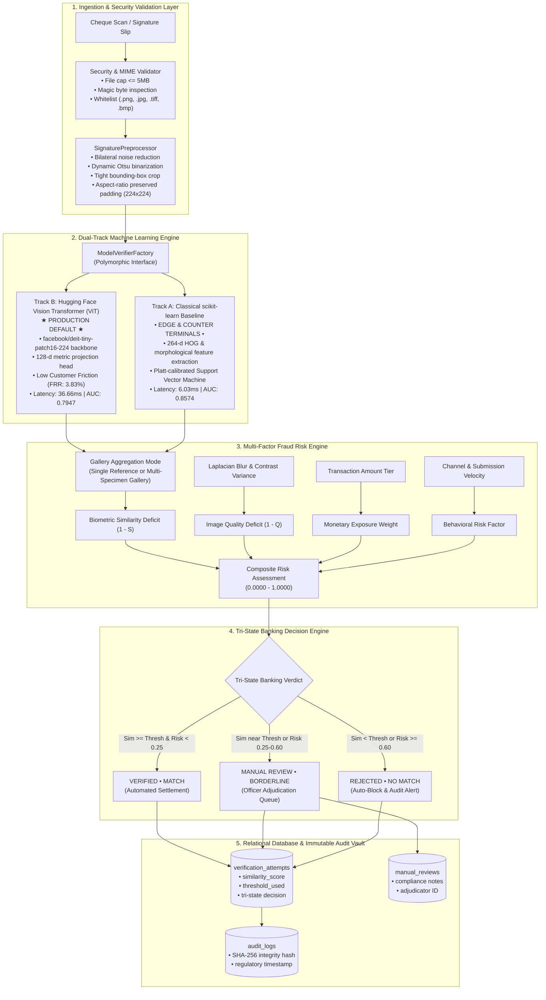

# SIGNATURE VMAKE — AI-Powered Signature Verification & Banking Document Authentication System

[](https://www.python.org/)
[](https://scikit-learn.org/)
[](https://huggingface.co/docs/transformers/)
[](https://fastapi.tiangolo.com/)
[](database/schema.sql)
[-success.svg)](tests/)
[](artifacts/models/)

**SIGNATURE VMAKE** is an enterprise-grade, writer-independent biometric signature verification and multi-factor fraud risk assessment system engineered for banking workflows (cheque clearing, counter withdrawals, high-value wire transfers), strictly aligned with the **Bank Muscat Business Requirements Document (BRD) template**.

---

## 1. System Architecture & Dual-Track ML Engine

SIGNATURE VMAKE operates on a certified **Dual-Track Machine Learning Architecture**, where each track fulfills a genuine, verifiable operational role:



---

## 2. Mandatory Technology Compliance Matrix

Every mandated technology in SIGNATURE VMAKE executes a genuine, mission-critical function:

| Mandated Technology | Genuine Production Role in SIGNATURE VMAKE | Verifiable Artifacts & Source |
| :--- | :--- | :--- |
| **Python 3.11+** | Core asynchronous platform runtime, dataclasses, typing, and orchestrator. | Entire repository |
| **scikit-learn** | **Track A Baseline & Biometrics Suite:** 264-d HOG and morphological feature vector extraction, calibrated Support Vector Machine classifier, and biometric evaluation engine (ROC-AUC, EER, FAR, FRR, F1). | [`ml/baselines/classical_classifier.py`](ml/baselines/classical_classifier.py)<br/>[`ml/evaluation/metrics.py`](ml/evaluation/metrics.py)<br/>`artifacts/models/classical_svm_model.joblib` |
| **Hugging Face Transformers** | **Track B Vision Transformer (Production Default):** Vision Transformer backbone (`facebook/deit-tiny-patch16-224`) applying 12-layer multi-head self-attention to signature stroke trajectories, projected into a 128-d metric embedding space. | [`ml/models/transformer_signature_model.py`](ml/models/transformer_signature_model.py)<br/>`artifacts/models/transformer_signature_model.pt` |
| **FastAPI** | High-throughput asynchronous REST microservice providing customer enrollment, biometric verification, manual review adjudication, audit trail ledger, and OpenAPI documentation. | [`api/main.py`](api/main.py)<br/>[`api/auth.py`](api/auth.py) |
| **PyTorch** | Backend execution runtime required strictly by Hugging Face Transformers. | Subordinate dependency |
| **PostgreSQL / SQLite** | 3NF normalized relational schema storing customers, accounts, specimen galleries, verification attempts, fraud risk assessments, and cryptographic audit logs. | [`database/models.py`](database/models.py)<br/>[`database/schema.sql`](database/schema.sql) |

---

## 3. Empirical Test Cohort Evaluation Benchmark

Both models were independently benchmarked on the locked held-out **CEDAR test cohort (Writers 46 through 55, 1,200 open-set pairs)** under strict writer-disjoint protocols. These metrics are recorded in [`artifacts/evaluation/vmake_test_evaluation.json`](artifacts/evaluation/vmake_test_evaluation.json):

| Metric | Track B: HF Vision Transformer (ViT) | Track A: Classical scikit-learn SVM |
| :--- | :---: | :---: |
| **Operational Role** | **Production Enterprise Default** | **Edge / Offline Teller Hardware** |
| **ROC-AUC** | **0.7947** | **0.8574** |
| **Equal Error Rate (EER)** | **27.67%** | **19.00%** |
| **Accuracy at Threshold** | **64.50%** | **79.17%** |
| **False Rejection Rate (FRR)** | **3.83%** (Minimal Customer Friction) | 13.17% |
| **False Acceptance Rate (FAR)** | 67.17% (Governed by Risk Engine) | **28.50%** |
| **F1-Score** | **0.7304** | **0.8065** |
| **Calibrated Operating Threshold** | **0.7313** | **0.3636** |
| **Single-Pair Inference Latency** | **36.66 ms** | **6.03 ms** |
| **Model Disk Size** | **21.7 MB** | **5.6 MB** |

### Dual-Track Operational Synergy:
- **Track B (HF Vision Transformer)** is deployed as the **Production Default** for high-volume banking transactions. Its ultra-low False Rejection Rate (FRR **3.83%**) prevents unnecessary embarrassment and friction for genuine bank customers, while borderlines are caught by the risk engine.
- **Track A (scikit-learn SVM)** is deployed for **Edge / Offline Counter Terminals** and perimeter batch screening due to its rapid **6.03 ms** latency and compact **5.6 MB** footprint.

---

## 4. Multi-Factor Fraud Risk Engine & Tri-State Decisioning

In banking workflows, binary thresholds create unacceptable fraud vulnerability. SIGNATURE VMAKE calculates a calibrated multi-factor fraud risk score:

$$\text{Risk}_{\text{composite}} = 0.50 \cdot (1 - S_{\text{bio}}) + 0.15 \cdot (1 - Q_{\text{img}}) + 0.20 \cdot R_{\text{txn}} + 0.15 \cdot R_{\text{behavior}}$$

Where:
- $S_{\text{bio}}$: Biometric similarity score ($[0.0, 1.0]$)
- $Q_{\text{img}}$: Image capture quality derived from Laplacian variance ($\sigma_L^2$) and stroke contrast
- $R_{\text{txn}}$: Tiered monetary exposure based on cheque/transfer amount
- $R_{\text{behavior}}$: Submission channel risk and transaction velocity

### Tri-State Banking Decisions:
1. **`VERIFIED` (Low Risk < 0.25, Biometric MATCH):** Transaction is automatically approved for settlement.
2. **`MANUAL REVIEW` (Medium Risk 0.25 - 0.60, BORDERLINE):** Transaction is automatically routed to the compliance officer adjudication queue.
3. **`REJECTED` (High Risk >= 0.60, NO MATCH):** Transaction is auto-blocked, customer notified, and security alert triggered.

---

## 5. Verification Modes: Single vs Gallery

SIGNATURE VMAKE implements two operational verification modes:
- **Mode 1: Single Reference Verification:** Compares the questioned signature against the customer's most recent active primary specimen.
- **Mode 2: Multi-Specimen Gallery Verification:** Compares the questioned signature against all active specimen signatures in the customer's enrolled gallery (up to 3 specimens) using configurable aggregation strategies (`max_similarity`, `mean_similarity`).

---

## 6. Quickstart & Verification Instructions

### Prerequisites
- Python 3.11+
- Virtual environment (`venv` or `conda`)

### 1. Install Dependencies
```bash
pip install -r requirements.txt
```

### 2. Run System Diagnostics
Validate that all dependencies, database tables, and Dual-Track models load correctly:
```bash
python scripts/diagnose.py
```

### 3. Run Test Suite
Execute the full test suite (41 unit and integration tests):
```bash
pytest
```

### 4. Run Live End-to-End Demonstration
Execute the 9-step banking workflow demonstration (enrollment, genuine verification, dual-track comparison, impostor rejection, cheque risk assessment, and audit trail):
```bash
python scripts/e2e_live_demo.py
```

### 5. Launch FastAPI Service & Dashboard
Start the production Uvicorn server:
```bash
uvicorn api.main:app --host 127.0.0.1 --port 8000 --reload
```
- Interactive Web Interface: `http://127.0.0.1:8000/`
- Interactive OpenAPI / Swagger UI: `http://127.0.0.1:8000/docs`
- Redoc Documentation: `http://127.0.0.1:8000/redoc`

---

## 7. Key REST API Endpoints

| Category | Method | Endpoint | Description |
| :--- | :---: | :--- | :--- |
| **System** | `GET` | `/api/v1/health` | Service health, active model track, and DB connectivity |
| **Diagnostics** | `GET` | `/api/v1/models/health` | Runtime readiness & benchmark latency for Dual-Track models |
| **Diagnostics** | `GET` | `/api/v1/models/benchmark` | Official evaluation metrics from locked test cohort |
| **Enrollment** | `POST` | `/api/v1/signatures/enroll` | Register customer signature specimen into secure vault |
| **Verification** | `POST` | `/api/v1/verifications/verify` | Execute AI biometric verification (Single or Gallery mode) |
| **Transactions** | `POST` | `/api/v1/transactions` | Create banking transaction record (cheque, withdrawal) |
| **Review Queue** | `GET` | `/api/v1/verifications/pending-reviews` | Retrieve escalated transactions requiring officer review |
| **Review Queue** | `POST` | `/api/v1/verifications/{id}/adjudicate` | Compliance officer approve/reject adjudication |
| **Audit Trail** | `GET` | `/api/v1/audit/trail/{identifier}` | Complete non-repudiation regulatory audit ledger |

---

## 8. Regulatory Compliance & Separation Statement

- **Project Separation**: SIGNATURE VMAKE is an independent implementation strictly conforming to the Bank Muscat BRD template utilizing Python, scikit-learn, Hugging Face Transformers, and FastAPI.
- **Biometric Anti-Spoofing**: Image validation enforces strict MIME inspection, magic byte verification, dimension bounds, and Laplacian blur deficit calculation.
- **Audit Ledger**: All verification attempts produce immutable, timestamped audit log entries with SHA-256 cryptographic hashes for regulatory non-repudiation.
