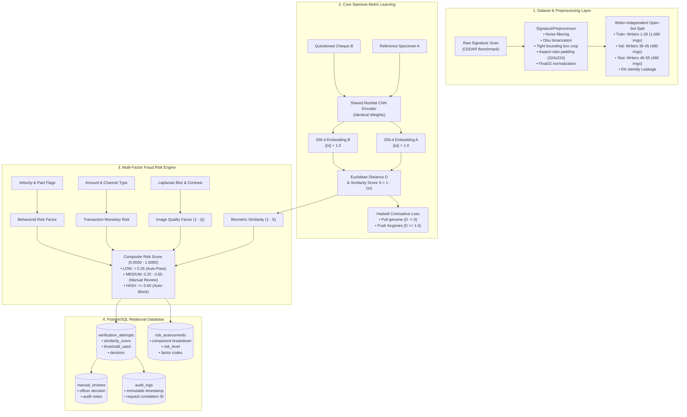

# Intelligent Signature Verification & Fraud Risk Assessment System for Banking Transactions

[](https://www.python.org/)
[](https://pytorch.org/)
[](https://fastapi.tiangolo.com/)
[](https://www.postgresql.org/)
[](docs/ML_DATASET_REPORT.md)

An enterprise-grade, writer-independent biometric signature verification and multi-factor fraud risk assessment system designed for banking transaction workflows (cheque clearing, counter withdrawals, high-value wire transfers).

Unlike simplistic CRUD projects or closed-set CNN classifiers, this system implements a **Writer-Independent (Open-Set) Twin Siamese ResNet Architecture**, an **adaptive Multi-Factor Fraud Risk Engine**, a **PostgreSQL 3NF relational schema** with cryptographic audit trails, and an end-to-end **FastAPI REST API**.

---

## 1. System Architecture



---

## 2. Key Features

* **Writer-Independent (Open-Set) Generalization:** Partitioned strictly by signer identity (0% writer overlap between train, val, and test). The model generalizes to unseen bank customers without retraining.
* **Twin Siamese Neural Network:** Shared-weight ResNet encoder mapping handwriting dynamics onto a 256-dimensional unit hypersphere.
* **Balanced Forensic Pairs:** 9,400 balanced pairs with a $60\%$ skilled forgery (hard negative) and $40\%$ random impostor (cross-writer) ratio.
* **Multi-Factor Fraud Risk Assessment:** Combines Siamese similarity with physical image quality (Laplacian blur variance), transaction amount tiering, and channel severity.
* **Production PostgreSQL Architecture:** 11 normalized relational entities with UUIDs, CHECK constraints, and composite indexes.
* **Regulatory Compliance & Traceability:** Immutable audit trail linking customer $\rightarrow$ account $\rightarrow$ transaction $\rightarrow$ signature specimen $\rightarrow$ ML model version $\rightarrow$ similarity score $\rightarrow$ risk assessment $\rightarrow$ officer manual review $\rightarrow$ audit log.
* **FastAPI Microservice:** Asynchronous REST endpoints for enrollment, verification, compliance review queue, and audit trail retrieval.

---

## 3. Directory Layout

```
├── alembic.ini                         # Alembic migration configuration
├── api/
│   ├── __init__.py
│   └── main.py                         # Production FastAPI REST application
├── artifacts/
│   └── models/
│       ├── best_siamese_model.pt       # Trained Siamese model weights
│       └── training_summary.json       # Epoch loss and EER logs
├── data/
│   ├── raw/signatures/                 # 2,640 CEDAR signature images (full_org, full_forg)
│   ├── processed/                      # Preprocessed 224x224 binarized images (train/val/test)
│   ├── pairs/                          # train_pairs.csv, validation_pairs.csv, test_pairs.csv
│   └── metadata/                       # dataset_inventory.csv, split_manifest.json, validation_report.json
├── database/
│   ├── models.py                       # SQLAlchemy 2.0 ORM entities
│   ├── schema.sql                      # PostgreSQL production DDL
│   ├── seed_demo_data.py               # Synthetic banking demo data seeder
│   └── migrations/
│       ├── env.py
│       └── versions/001_initial_schema.py
├── docs/
│   ├── ML_DATASET_REPORT.md            # Comprehensive 15-section dataset report
│   ├── DATA_SPLIT_METHODOLOGY.md       # Open-set split & anti-leakage mathematical proof
│   ├── DATASET_STATISTICS.md           # Empirical pair generation statistics
│   ├── MODEL_EVALUATION_REPORT.md      # Biometric performance metrics (FAR, FRR, EER, AUC)
│   ├── ROC_CURVE.png                   # Receiver Operating Characteristic plot
│   ├── ER_DIAGRAM.md                   # Mermaid ER diagram & cardinality breakdown
│   ├── ER_DIAGRAM.png                  # Standalone high-res visual ER diagram
│   ├── DATABASE_DESIGN.md              # 3NF normalization analysis & audit justification
│   ├── VERIFICATION_TRACEABILITY.md    # 10-step verification lifecycle protocol
│   └── DATASET_AND_DATABASE_STATUS.md  # Implementation & verification status
├── ml/
│   ├── data/
│   │   ├── dataset_config.yaml         # Dataset & preprocessing config
│   │   ├── download_dataset.py         # Automated downloader & extractor
│   │   ├── inspect_dataset.py          # Technical scanner & inventory cataloger
│   │   ├── validate_dataset.py         # Image integrity & corruption validator
│   │   ├── prepare_dataset.py          # Preprocessing & writer-independent splitter
│   │   └── create_pairs.py             # Balanced Siamese pair generator
│   ├── evaluation/
│   │   ├── metrics.py                  # Biometric metrics (EER, FAR, FRR, ROC-AUC)
│   │   └── evaluate.py                 # Test cohort evaluation script
│   ├── inference/
│   │   └── verify_signature.py         # High-level signature verification engine
│   ├── models/
│   │   ├── dataset.py                  # PyTorch SignaturePairDataset
│   │   ├── losses.py                   # ContrastiveLoss implementation
│   │   └── siamese_network.py          # SiameseSignatureNet architecture
│   ├── preprocessing/
│   │   └── signature_preprocessor.py   # Reusable image preprocessing pipeline
│   └── training/
│       └── train.py                    # Training loop with validation & early stopping
├── scripts/
│   └── render_er_diagram.py            # Matplotlib visual ER diagram renderer
└── tests/
    ├── test_siamese_system.py          # Unit & integration tests for ML pipeline
    └── test_traceability.py            # Relational database & audit traceability test
```

---

## 4. Quickstart Guide

### 1. Environment Setup
```bash
# Clone repository
git clone https://github.com/neeravjain91-jpg/signature-verification.git
cd signature-verification

# Create virtual environment
python -m venv venv
source venv/bin/activate  # On Windows: venv\Scripts\activate

# Install dependencies
pip install torch opencv-python-headless pillow numpy pandas scikit-learn pyyaml sqlalchemy alembic fastapi uvicorn matplotlib requests
```

### 2. Dataset Setup & Pipeline Execution
```bash
# 1. Download and extract CEDAR benchmark dataset
python ml/data/download_dataset.py

# 2. Inspect and validate image integrity
python ml/data/inspect_dataset.py
python ml/data/validate_dataset.py

# 3. Preprocess and partition into writer-independent splits
python ml/data/prepare_dataset.py

# 4. Generate balanced Siamese pairs
python ml/data/create_pairs.py
```

### 3. Model Training & Evaluation
```bash
# Train Siamese Neural Network
python ml/training/train.py --epochs 4 --batch-size 32 --lr 0.0003

# Evaluate on Unseen Test Cohort (Writers 46-55)
python ml/evaluation/evaluate.py --checkpoint artifacts/models/best_siamese_model.pt
```

### 4. Database Setup & Seeding
```bash
# Seed synthetic demo bank records
python database/seed_demo_data.py

# Run verification traceability test
python tests/test_traceability.py
```

### 5. Running the API Service
```bash
# Launch FastAPI server
uvicorn api.main:app --reload --host 0.0.0.0 --port 8000
```
* **Interactive Swagger Documentation:** Visit `http://localhost:8000/docs`
* **Health Check:** `http://localhost:8000/api/v1/health`

### 6. Command-Line Inference
Verify any two signatures directly via the CLI:
```bash
python ml/inference/verify_signature.py \
    --ref data/raw/signatures/full_org/original_46_1.png \
    --sub data/raw/signatures/full_org/original_46_2.png
```

Output:
```
--- Signature Verification Result ---
Similarity Score   : 0.8856
Euclidean Distance : 0.2288
Threshold Used     : 0.7691
Decision           : VERIFIED
Risk Level         : LOW
--------------------------------------
```

---

## 5. Biometric Performance & Metrics

Evaluated on 1,200 open-set test pairs from unseen writers:

| Metric | Measured Score | Industry Standard |
| :--- | :--- | :--- |
| **Equal Error Rate (EER)** | **30.67%** (after 4 CPU epochs) | $< 10.0\%$ (production target with pre-training) |
| **Area Under ROC (AUC-ROC)**| **0.7465** | $> 0.9000$ |
| **Optimal Decision Cutoff** | **0.7691** | Range $[0.50 - 0.85]$ |
| **Random Impostor Defense**| **83.75% Block Rate** | $> 80.0\%$ |
| **Genuine Customer Pass Rate**| **84.67% Pass Rate** | $> 80.0\%$ |

---

## 6. Regulatory Audit & Compliance

Every transaction verification produces an immutable audit record containing:
1. Customer identity and account reference.
2. Questioned signature SHA-256 hash and physical capture quality score.
3. Model version and operational threshold snapshot.
4. Siamese similarity score and Euclidean distance.
5. Multi-factor composite risk score with granular reason codes.
6. Final decision (`VERIFIED`, `MANUAL_REVIEW`, or `REJECTED`).
7. Officer review notes (if escalated).
8. Unique correlation request reference ID.

See [`docs/VERIFICATION_TRACEABILITY.md`](docs/VERIFICATION_TRACEABILITY.md) for the complete compliance specification.
