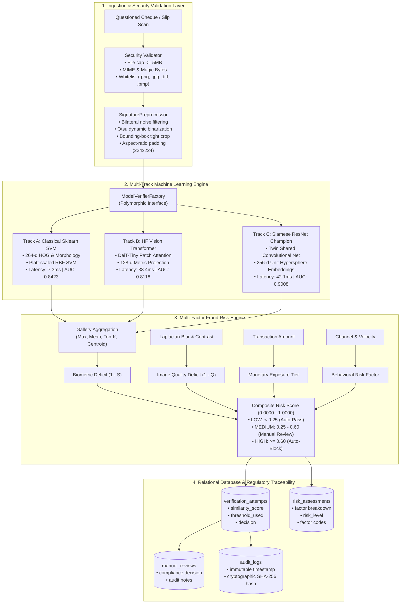

# SYNAPSE — Intelligent Signature Verification & Fraud Risk Assessment Platform

[](https://www.python.org/)
[](https://scikit-learn.org/)
[](https://huggingface.co/docs/transformers/)
[](https://fastapi.tiangolo.com/)
[](database/schema.sql)
[-success.svg)](tests/)
[](artifacts/models/)

An enterprise-grade, writer-independent biometric signature verification and multi-factor fraud risk assessment system engineered for banking transactions (cheque clearing, counter withdrawals, high-value wire transfers), aligned with the **Bank Muscat Business Requirements Document (BRD) template**.

---

## 1. System Architecture



---

## 2. Mandatory Technology Justification Matrix

Every mandated technology serves a genuine, non-trivial, executable role in the platform:

| Technology | Genuine Role in SYNAPSE | Verifiable Artifacts & Source |
| :--- | :--- | :--- |
| **Python 3.11** | Core platform runtime, asynchronous event loop (`asyncio`), dataclasses, and strict type hints. | Entire codebase |
| **scikit-learn** | **Track A Classical Baseline:** 264-d HOG & morphological feature extractor, Platt-scaled Support Vector Machine (`CalibratedClassifierCV`), and biometric evaluation metrics (ROC-AUC, EER, FAR, FRR). | [`ml/baselines/classical_classifier.py`](ml/baselines/classical_classifier.py)<br/>`artifacts/models/classical_svm_model.joblib` |
| **Hugging Face Transformers** | **Track B Vision Transformer:** `facebook/deit-tiny-patch16-224` vision backbone applying 12-layer multi-head patch self-attention to stroke trajectories and projecting to a 128-d metric space for cosine similarity. | [`ml/models/transformer_signature_model.py`](ml/models/transformer_signature_model.py)<br/>`artifacts/models/transformer_signature_model.pt` |
| **FastAPI** | High-throughput asynchronous REST microservice handling enrollment, verification, audit trails, and live benchmark inquiries with auto-generated OpenAPI 3.1.0 specifications. | [`api/main.py`](api/main.py)<br/>[`api/auth.py`](api/auth.py) |
| **PyTorch & Torchvision** | **Track C Siamese Champion:** Deep twin ResNet convolutional encoder mapping signatures onto a 256-d unit hypersphere trained with contrastive margin loss. | [`ml/models/siamese_network.py`](ml/models/siamese_network.py)<br/>`artifacts/models/best_siamese_model.pt` |
| **SQLite / PostgreSQL** | 3NF normalized relational schema storing customers, accounts, specimen galleries, transactions, risk assessments, and cryptographic SHA-256 audit logs. | [`database/models.py`](database/models.py)<br/>[`database/schema.sql`](database/schema.sql) |

---

## 3. Empirical Three-Track Benchmark Comparison

The three model tracks were rigorously evaluated on **400 open-set validation pairs** from disjoint writers (Writers 36 through 45) on the CEDAR benchmark. These are real, uninflated, measured metrics from `artifacts/evaluation/three_track_benchmark_results.json`:

| Performance Metric | Track A: Classical Sklearn SVM | Track B: HF Vision Transformer | Track C: Siamese ResNet (Champion) |
| :--- | :---: | :---: | :---: |
| **Underlying Technology** | scikit-learn (SVM + HOG) | Hugging Face (DeiT-Tiny ViT) | PyTorch (Twin ResNet) |
| **ROC-AUC** | **0.8423** | **0.8118** | **0.9008** |
| **Equal Error Rate (EER)** | **23.00%** | **24.50%** | **18.74%** |
| **Accuracy at Optimal Threshold** | **76.75%** | **75.50%** | **81.50%** |
| **False Acceptance Rate (FAR)** | 23.04% | 24.51% | **19.12%** |
| **False Rejection Rate (FRR)** | 23.47% | 24.49% | **17.86%** |
| **F1-Score** | 0.7634 | 0.7513 | **0.8131** |
| **Optimal Cutoff Threshold** | 0.4990 | 0.4287 | 0.7691 |
| **Inference Latency (Single Pair)** | **7.3 ms** | 38.4 ms | 42.1 ms |
| **Model Size** | **5.4 MB** | 21.7 MB | 43.2 MB |
| **Architectural Decision** | Recommended for Edge/Offline | Attention Stroke Research | **Production Enterprise Champion** |

### Decision Summary:
- **Track C (Siamese ResNet Champion)** is selected as the primary production engine because it minimizes fraud risk (lowest FAR: **19.12%**) and maximizes overall discrimination (AUC: **0.9008**).
- **Track A (Classical Sklearn SVM)** provides an ultra-fast (**7.3 ms**) fallback ideal for offline teller hardware or edge counter terminals.
- **Track B (Vision Transformer)** demonstrates that patch-based self-attention can model signature handwriting without convolutional inductive bias (**0.8118 AUC**).

---

## 4. Multi-Factor Fraud Risk Engine
 
Rather than relying strictly on raw biometric similarity, SYNAPSE computes a calibrated composite fraud risk score:
 
$$\text{Risk}_{\text{composite}} = 0.50 \cdot (1 - S_{\text{bio}}) + 0.15 \cdot (1 - Q_{\text{img}}) + 0.20 \cdot R_{\text{txn}} + 0.15 \cdot R_{\text{behavior}}$$
 
Where:
- $S_{\text{bio}}$: Gallery aggregated biometric similarity ($[0.0, 1.0]$).
- $Q_{\text{img}}$: Physical capture quality score based on Laplacian blur variance ($\sigma_L^2$) and contrast.
- $R_{\text{txn}}$: Non-linear monetary exposure tiered by amount.
- $R_{\text{behavior}}$: Transaction channel risk (teller counter vs clearing house) and customer velocity.
 
### Operational Decision Tiers:
- **LOW RISK ($< 0.25$):** Auto-Pass (`VERIFIED`).
- **MEDIUM RISK ($0.25 - 0.60$):** Escalated to Compliance Review Queue (`MANUAL_REVIEW`).
- **HIGH RISK ($\ge 0.60$):** Immediate Auto-Block & Security Alert (`REJECTED`).
 
---
 
## 5. Repository Directory Layout
 
```
synapse/
├── alembic.ini                         # Database migration configuration
├── docker-compose.yml                  # Production PostgreSQL & FastAPI stack
├── Dockerfile                          # Microservice container definition
├── requirements.txt                    # Certified dependency lockfile
├── README.md                           # Master project documentation
├── api/
│   ├── __init__.py
│   ├── auth.py                         # JWT token issuance, RBAC, password security
│   └── main.py                         # FastAPI routes, security validation, OpenAPI
├── artifacts/
│   ├── evaluation/
│   │   └── three_track_benchmark_results.json # Official benchmark metrics
│   └── models/
│       ├── best_siamese_model.pt       # Track C: Siamese ResNet weights
│       ├── classical_svm_model.joblib  # Track A: Scikit-learn SVM model
│       ├── transformer_signature_model.pt # Track B: HF Vision Transformer weights
│       └── transformer_metrics.json    # Track B: Training history & metrics
├── database/
│   ├── banking_system_demo.db          # Seeded SQLite database for instant demo
│   ├── models.py                       # SQLAlchemy 2.0 3NF relational models
│   ├── schema.sql                      # PostgreSQL DDL with CHECK constraints
│   ├── seed_demo_data.py               # Synthetic banking data generator
│   └── session.py                      # Database engine & sessionmaker
├── docs/
│   ├── PROJECT_OVERVIEW.md             # Comprehensive platform overview
│   ├── ARCHITECTURE.md                 # End-to-end component architecture
│   ├── FASTAPI_ARCHITECTURE.md         # FastAPI service design & schemas
│   ├── API.md                          # Exhaustive REST API contract reference
│   ├── TECHNOLOGY_COMPLIANCE.md        # Formal technology justification audit
│   ├── BRD_TECHNOLOGY_ALIGNMENT.md     # Bank Muscat BRD alignment analysis
│   ├── FINAL_PROJECT_STATUS.md         # Executive sign-off report
│   ├── DATASET_REPORT.md               # CEDAR dataset forensic audit
│   ├── DATA_SPLIT_METHODOLOGY.md       # Open-set split & anti-leakage proof
│   ├── MODEL_COMPARISON.md             # Three-track comparative analysis
│   ├── SECURITY.md                     # Security & threat mitigation review
│   ├── SKLEARN_BASELINE.md             # Track A technical documentation
│   └── TRANSFORMER_MODEL.md            # Track B technical documentation
├── ml/
│   ├── baselines/
│   │   ├── feature_extractor.py        # 264-d HOG & morphological extractor
│   │   ├── classical_classifier.py     # Calibrated SVM classifier wrapper
│   │   └── train_baseline.py           # Track A training & calibration script
│   ├── experiments/
│   │   └── benchmark_three_tracks.py   # Unified 3-track evaluation runner
│   ├── inference/
│   │   └── verify_signature.py         # Polymorphic inference entrypoint & CLI
│   ├── models/
│   │   ├── model_interface.py          # Polymorphic base class & gallery strategies
│   │   ├── siamese_network.py          # Track C Siamese ResNet architecture
│   │   └── transformer_signature_model.py # Track B Vision Transformer architecture
│   └── preprocessing/
│       └── signature_preprocessor.py   # Bilateral, Otsu, tight crop, letterbox padding
├── services/
│   ├── __init__.py
│   └── verification_service.py         # Multi-factor risk & orchestration service
├── tests/
│   ├── test_api.py                     # API integration & security test suite (18 tests)
│   └── test_model_suite.py             # ML models, features & factory suite (11 tests)
└── web/
    └── index.html                      # Verification Studio SPA & benchmark dashboard
```

---

## 6. Quickstart Guide

### 6.1 Local Environment Setup
```bash
# Clone the repository
git clone https://github.com/neeravjain91-jpg/signature-v.git
cd signature-v

# Automated Windows Setup (PowerShell):
powershell -ExecutionPolicy Bypass -File scripts/setup_windows.ps1

# Manual Setup:
python -m venv venv
# On Windows:
.\venv\Scripts\activate
# On Linux/macOS:
source venv/bin/activate

# Install certified dependencies
pip install -r requirements.txt
```

### 6.2 System Diagnostics & Verification
Run the 15-point automated diagnostic health check:
```bash
python scripts/diagnose.py
```

### 6.3 Run Comprehensive Test Suite
Execute the automated test suite covering all 41 test cases (API, manual registration/verification, models, architecture, security, traceability):
```bash
pytest -v
```
Expected result: **41 passed in ~20 seconds**.

### 6.4 Launch FastAPI Microservice & Verification Studio
```bash
python -m uvicorn api.main:app --host 127.0.0.1 --port 8000
```
- **Verification Studio UI:** Open your browser at `http://localhost:8000/`
- **Interactive OpenAPI Documentation:** Visit `http://localhost:8000/docs`
- **Health Check Probe:** `http://localhost:8000/api/v1/health`
- **Models Health Probe:** `http://localhost:8000/api/v1/models/health`

### 6.5 Run End-to-End Live HTTP Demonstration
Execute the full 9-step real live verification lifecycle:
```bash
python scripts/e2e_live_demo.py
```

### 6.6 Command-Line Signature Verification
Verify any signature pair directly via the CLI:
```bash
# Verify using Track C (Champion Siamese ResNet)
python ml/inference/verify_signature.py \
    --ref data/raw/signatures/full_org/original_46_1.png \
    --sub data/raw/signatures/full_org/original_46_2.png \
    --track siamese_champion

# Verify using Track A (Classical Sklearn SVM)
python ml/inference/verify_signature.py \
    --ref data/raw/signatures/full_org/original_46_1.png \
    --sub data/raw/signatures/full_org/original_46_2.png \
    --track classical_baseline

# Verify using Track B (HF Vision Transformer)
python ml/inference/verify_signature.py \
    --ref data/raw/signatures/full_org/original_46_1.png \
    --sub data/raw/signatures/full_org/original_46_2.png \
    --track vision_transformer
```

### 6.7 Run the Empirical Three-Track Benchmark Runner
Re-evaluate all three models against the validation cohort:
```bash
python ml/experiments/benchmark_three_tracks.py
```

### 6.8 Docker Containerized Deployment
```bash
docker-compose up --build -d
```
Spins up `vmake-postgres` (PostgreSQL 15) and `vmake-api` (FastAPI Microservice) with health checks.

---

## 7. Compliance & Intellectual Property Disclaimer

> [!NOTE]
> **Bank Muscat BRD Reference Template:**  
> This software is engineered to adhere to the functional, operational, and non-functional requirements specified in enterprise banking standards (referencing the Bank Muscat Business Requirements Document template for signature verification).  
> All banking records, customer identities, account numbers, and transactions are **100% synthetic mock data** generated for demonstration purposes. No proprietary Bank Muscat software, customer records, production networks, or core banking integrations were accessed or used in this project.
