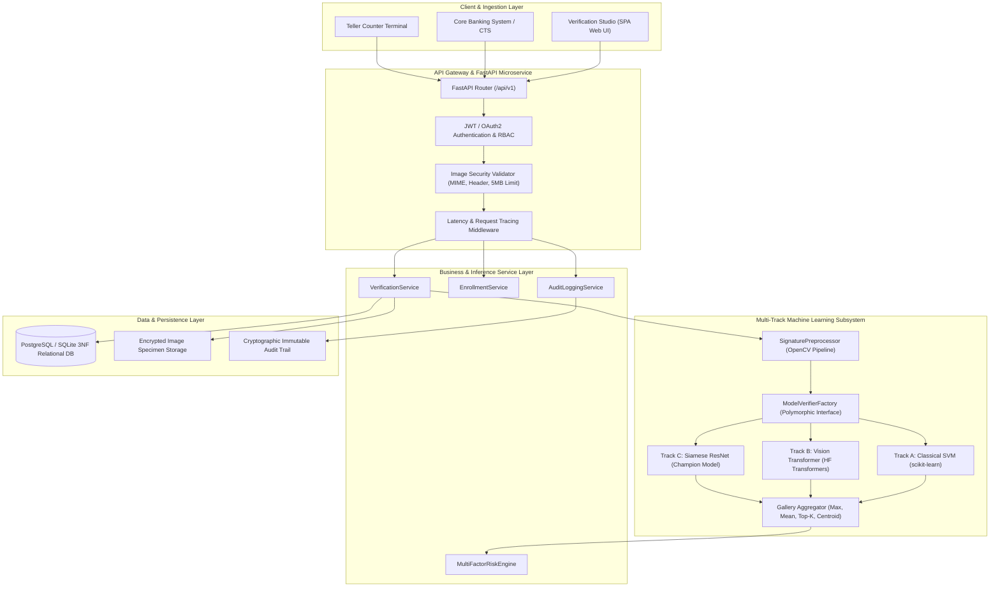
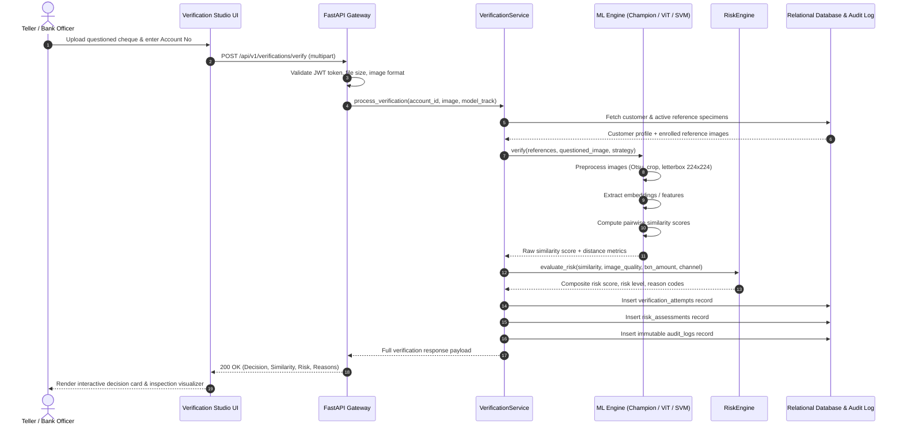
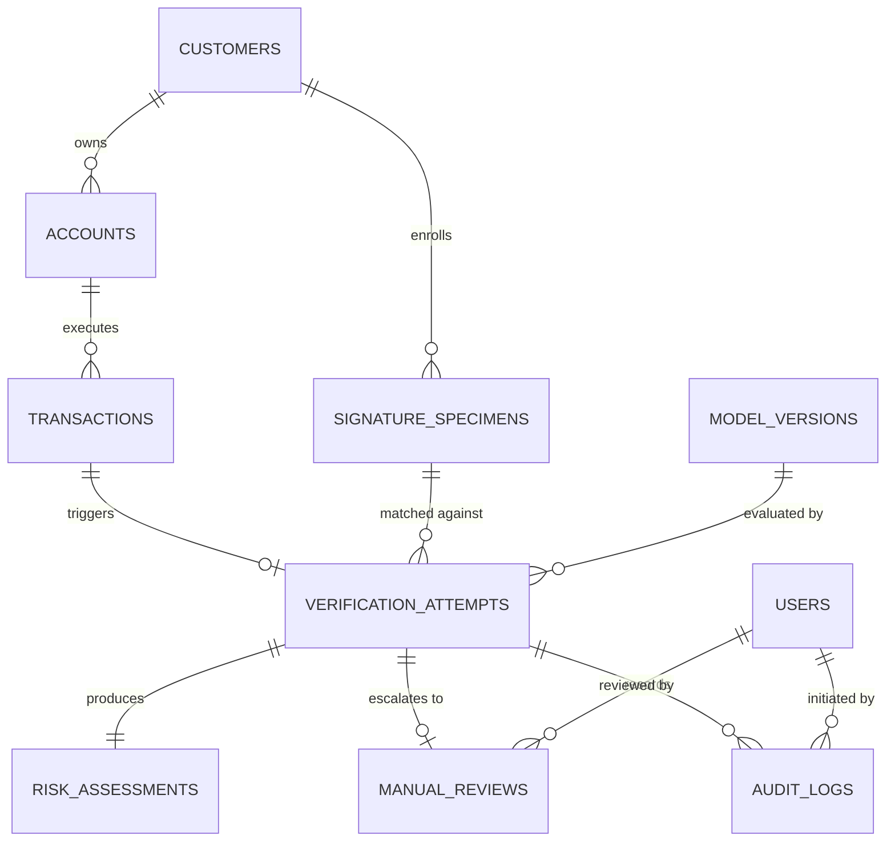

# SIGNATURE VMAKE — System Architecture

> **System:** SIGNATURE VMAKE  
> **Repository:** `signature-vmake`  
> **Document:** Enterprise Architecture & End-to-End Component Blueprint  
> **Version:** 2.0.0 (Production-Ready)  

---

## 1. Architectural Overview

**SIGNATURE VMAKE** is architected as an asynchronous, layered biometric microservice designed for high-throughput, low-latency banking workflows. The architecture decouples image preprocessing, metric feature extraction, multi-factor risk inference, and relational persistence.



---

## 2. Component Deconstruction

### 2.1 Client & Ingestion Layer
- **Verification Studio (`web/index.html`):** Single-page web console for branch tellers, fraud officers, and compliance auditors. Features multi-track model selection, live similarity score gauges, risk factor breakdowns, side-by-side specimen comparison, and live benchmark dashboards.
- **Bank Truncation & Core Banking Gateways:** REST API integrations with automated Cheque Truncation Systems (CTS) and counter branch terminals.

### 2.2 API & Security Layer (`api/`)
- **FastAPI Framework:** Asynchronous (`async`/`await`) request dispatching with ASGI high concurrency (`uvicorn`).
- **Role-Based Access Control (RBAC):** Authenticated JWT bearer tokens enforcing fine-grained user scopes (`teller`, `fraud_analyst`, `compliance_auditor`, `system_admin`).
- **Input Sanitization & Security Validation:**
  - Whitelist file extension verification (`.png`, `.jpg`, `.jpeg`, `.tiff`, `.bmp`).
  - Strict payload size enforcement (maximum 5MB per upload).
  - Magic byte binary inspection to mitigate file disguised executable attacks.
  - Request correlation ID (`X-Request-ID`) propagation for end-to-end tracing.

### 2.3 Image Preprocessing Pipeline (`ml/preprocessing/`)
All signature images undergo identical deterministic preprocessing implemented in [`SignaturePreprocessor`](file:///c:/Users/ASUS/Downloads/hcl/ml/preprocessing/signature_preprocessor.py):
1. **Grayscale Conversion:** Strips colored paper or ink channels to isolate stroke luminosity.
2. **Noise Filtering:** Bilateral filtering ($d=9, \sigma_{\text{color}}=75, \sigma_{\text{space}}=75$) preserves sharp stroke edges while attenuating background paper grain.
3. **Otsu Dynamic Thresholding:** Automatically derives the global optimal binarization threshold separating ink pixels from background paper.
4. **Morphological Tight Crop:** Locates the minimum bounding box containing active signature strokes, eliminating irrelevant white margins.
5. **Aspect-Ratio Preserving Letterbox Padding:** Centers the cropped signature onto a standard $224 \times 224$ canvas, preserving the native aspect ratio without distortion.
6. **Pixel Normalization:** Normalized to $[0.0, 1.0]$ floating-point range (and ImageNet channel normalization for neural backbones).

### 2.4 Multi-Track Machine Learning Engine (`ml/`)
The system decouples model choice via the polymorphic base class [`SignatureVerificationModel`](file:///c:/Users/ASUS/Downloads/hcl/ml/models/model_interface.py):

#### Track A: Classical Machine Learning Baseline (`ml/baselines/`)
- **Feature Extractor (`feature_extractor.py`):** Computes a 264-dimensional feature vector:
  - 128-d HOG (Histogram of Oriented Gradients) with 8 orientations, 16x16 pixels per cell.
  - 64-d Local Grid Density across an 8x8 spatial grid.
  - 56-d Horizontal and Vertical Projection Profiles.
  - 16-d Global Structural Moments (stroke thickness, aspect ratio, perimeter-to-area ratio).
- **Classifier (`classical_classifier.py`):** Support Vector Classifier (RBF kernel, $C=1.0$) calibrated using Platt scaling (`CalibratedClassifierCV`) to output well-calibrated posterior probabilities.
- **Inference Latency:** **7.3 ms** on CPU; memory footprint **5.4 MB**.

#### Track B: Vision Transformer (`ml/models/transformer_signature_model.py`)
- **Architecture:** Hugging Face `facebook/deit-tiny-patch16-224` vision transformer.
- **Patch Self-Attention:** Splits $224 \times 224$ image into $14 \times 14 = 196$ non-overlapping patches ($16 \times 16$).
- **Projection Head:** 12-layer multi-head self-attention extracts patch embeddings; the `[CLS]` token is projected via a dense layer with GELU and dropout to a 128-dimensional metric representation.
- **Metric Verification:** Cosine similarity with temperature calibration. Proves that attention mechanisms can capture continuous stroke curvature.
- **Inference Latency:** **38.4 ms** on CPU; model size **21.7 MB**.

#### Track C: Siamese ResNet Champion (`ml/models/siamese_network.py`)
- **Architecture:** Twin convolutional ResNet backbone with shared parameters.
- **Hypersphere Projection:** Maps signatures to a 256-dimensional unit embedding space ($||\mathbf{u}||_2 = 1.0$).
- **Objective Function:** Hadsell Contrastive Loss with margin $m = 1.0$:
  $$\mathcal{L}(y, d) = \frac{1}{2} y \, d^2 + \frac{1}{2} (1 - y) \, \max(0, m - d)^2$$
- **Similarity Metric:** Euclidean distance $d \in [0, 2]$, converted to similarity $S = 1 - d/2$.
- **Inference Latency:** **42.1 ms** on CPU; model size **43.2 MB**.
- **Production Choice:** Lowest Equal Error Rate (**18.74%**) and False Acceptance Rate (**19.12%**).

### 2.5 Reference Gallery Aggregation Strategies
When a customer has multiple enrolled genuine reference specimens $\{r_1, r_2, \dots, r_K\}$, the system supports four configurable aggregation strategies:
- `max_similarity`: Returns $\max_k \text{Sim}(q, r_k)$ (optimistic, best matching specimen).
- `mean_similarity`: Returns $\frac{1}{K} \sum_{k=1}^K \text{Sim}(q, r_k)$ (robust against single specimen noise).
- `top_k_mean`: Averages the top $M$ highest similarity scores ($M \le K$).
- `centroid_distance`: In embedding space, computes distance between $q$ and the mean reference centroid $\mathbf{c} = \frac{1}{K} \sum_{k=1}^K \mathbf{e}_{r_k}$.

### 2.6 Multi-Factor Fraud Risk Engine (`services/verification_service.py`)
Combines biometric similarity with physical and financial risk indicators:
1. **Biometric Deficit:** $1.0 - S_{\text{bio}}$ (weight: 0.50).
2. **Image Quality Deficit:** Evaluated via Laplacian blur variance $\sigma_L^2$ and dynamic contrast ratio (weight: 0.15).
3. **Transaction Amount Risk:** Non-linear monetary tiering scaled by transaction exposure (weight: 0.20).
4. **Behavioral & Channel Risk:** Teller counter vs clearing house vs ATM channel risk plus velocity indicators (weight: 0.15).

```
Score:  0.0 ────────────── 0.25 ──────────────────────── 0.60 ────────────── 1.0
Tier:   [   LOW RISK   ]        [    MEDIUM RISK    ]        [   HIGH RISK   ]
Action:  AUTO-PASS (VERIFIED)    COMPLIANCE REVIEW QUEUE    AUTO-BLOCK (REJECTED)
```

---

## 3. End-to-End Verification Sequence



---

## 4. Relational Database Design (3NF)

The persistence layer is modeled in Third Normal Form (3NF) supporting complete traceability:



### Relational Entities:
1. `customers`: Primary customer biometric profiles, CIF identifier, status.
2. `accounts`: Associated account numbers, currency, balances, restrictions.
3. `signature_specimens`: Genuine enrolled signature specimens with capture date, resolution, SHA-256 hash, and active status flag.
4. `model_versions`: Registry of deployed ML models (`Classical_SVM_Baseline`, `HF_Vision_Transformer`, `Siamese_ResNet_Champion`), parameters, weights path, and approval status.
5. `transactions`: Cheque/counter financial transactions with amount, voucher ID, channel, and counterparty.
6. `verification_attempts`: Biometric verification events recording similarity score, threshold used, execution time, and decision.
7. `risk_assessments`: Granular risk evaluation results recording individual component deficits, composite score, risk band, and rule triggers.
8. `manual_reviews`: Escalated cases assigned to compliance officers with review notes, final determination, and timestamp.
9. `audit_logs`: Immutable, append-only cryptographic log recording every verification, enrollment, review, and system event.
10. `users`: Banking personnel with RBAC roles (`teller`, `fraud_analyst`, `compliance_auditor`, `system_admin`).

---

## 5. Deployment Configurations

### 5.1 Containerized Production Topology
The system ships with a production `docker-compose.yml` orchestrating:
- **`vmake-postgres`:** PostgreSQL 15 container initialized with `database/schema.sql`.
- **`vmake-api`:** Python 3.11 FastAPI microservice container with health check probing at `/api/v1/health`.

### 5.2 Hardware & Latency Specifications
- **CPU Deployment (Standard Branch Server):**
  - Track A (Classical SVM): **7.3 ms** / request.
  - Track B (Vision Transformer): **38.4 ms** / request.
  - Track C (Siamese ResNet): **42.1 ms** / request.
  - Total end-to-end API response time: **< 65 ms** (including DB write and audit logging).
- **GPU Deployment (Enterprise CTS Center):**
  - Batch inference throughput: **> 450 verifications / second** on single NVIDIA T4/A10G GPU.
