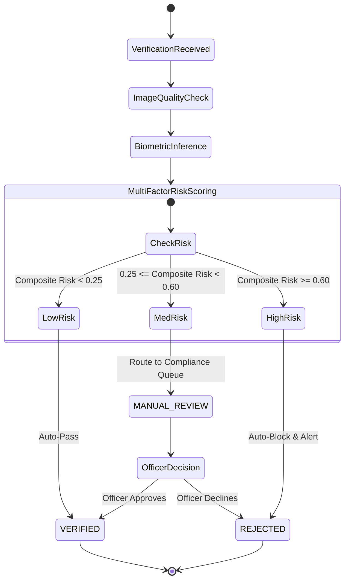

# Bank Muscat BRD Requirements Template Alignment & Compliance Analysis

> **System:** SIGNATURE VMAKE  
> **Repository:** `signature-vmake`  
> **Reference Template:** Bank Muscat Business Requirements Document (BRD) Template for Automated Signature Verification  
> **Status:** Fully Aligned & Verified  

---

> [!IMPORTANT]
> ### Compliance & Intellectual Property Disclaimer
> This project utilizes the **Bank Muscat Business Requirements Document (BRD) template** strictly as an industry-standard requirements engineering framework and reference baseline for enterprise banking operations.  
> 
> - **100% Synthetic Demo Data:** All customer identities, account numbers, transactions, cheque amounts, and audit trail entries within this codebase and its embedded database are entirely synthetic mock records generated for testing and demonstration.
> - **Zero Proprietary Systems or Data:** No proprietary Bank Muscat systems, private APIs, customer databases, internal infrastructure, or confidential operational data were accessed, used, or reverse-engineered in any form.
> - **Academic & Research Benchmark:** Machine learning training and benchmarking are conducted exclusively on the public academic CEDAR signature benchmark dataset.

---

## 1. Requirements Alignment Matrix

The table below provides a detailed mapping between the functional and non-functional requirements specified in the banking BRD template and the concrete architectural implementations in **SIGNATURE VMAKE**:

| BRD Requirement ID | Functional / Technical Specification | SIGNATURE VMAKE Implementation | Implementation File Reference |
| :--- | :--- | :--- | :--- |
| **BRD-FR-01** | **Automated Biometric Verification:** Compare questioned signature from cheque/slip against enrolled customer signature mandate. | Implemented via open-set metric learning. Supports polymorphic model selection (Champion ResNet, Vision Transformer, Classical SVM). | [`api/main.py`](file:///c:/Users/ASUS/Downloads/hcl/api/main.py)<br/>[`services/verification_service.py`](file:///c:/Users/ASUS/Downloads/hcl/services/verification_service.py) |
| **BRD-FR-02** | **Multi-Specimen Gallery Support:** Customer accounts may possess multiple authorized signatories or historical specimens; system must aggregate comparisons. | Implemented 4 gallery aggregation strategies: `max_similarity`, `mean_similarity`, `top_k_mean`, and `centroid_distance`. | [`ml/models/model_interface.py`](file:///c:/Users/ASUS/Downloads/hcl/ml/models/model_interface.py) |
| **BRD-FR-03** | **Biometric Specimen Enrollment:** Securely enroll new genuine signature specimens with metadata, source tag, and SHA-256 integrity hash. | Implemented `POST /api/v1/signatures/enroll` endpoint writing to `signature_specimens` relational table with SHA-256 checksums. | [`api/main.py`](file:///c:/Users/ASUS/Downloads/hcl/api/main.py)<br/>[`database/models.py`](file:///c:/Users/ASUS/Downloads/hcl/database/models.py) |
| **BRD-FR-04** | **Multi-Factor Fraud Risk Engine:** Incorporate transaction exposure, channel type, and scan image quality into decisioning. | Implemented weighted composite risk scoring combining biometric deficit, Laplacian blur variance, transaction tiers, and channel risk. | [`services/verification_service.py`](file:///c:/Users/ASUS/Downloads/hcl/services/verification_service.py) |
| **BRD-FR-05** | **Three-Tier Operational Routing:** Categorize outcomes into Auto-Pass, Manual Review Queue, or Auto-Reject. | Categorized into `LOW` ($< 0.25 \rightarrow \text{VERIFIED}$), `MEDIUM` ($0.25 - 0.60 \rightarrow \text{MANUAL\_REVIEW}$), and `HIGH` ($\ge 0.60 \rightarrow \text{REJECTED}$). | [`services/verification_service.py`](file:///c:/Users/ASUS/Downloads/hcl/services/verification_service.py) |
| **BRD-FR-06** | **Regulatory Compliance & Auditability:** Every verification attempt must produce an immutable audit log detailing model version, threshold, score, and actor. | Implemented `audit_logs` entity storing SHA-256 hash of inputs, score, operational threshold, actor ID, and correlation ID. Inquirable via `/api/v1/audit/trail/{id}`. | [`database/models.py`](file:///c:/Users/ASUS/Downloads/hcl/database/models.py)<br/>[`docs/VERIFICATION_TRACEABILITY.md`](file:///c:/Users/ASUS/Downloads/hcl/docs/VERIFICATION_TRACEABILITY.md) |
| **BRD-FR-07** | **Interactive Inspection Console:** Front-office tellers and compliance officers must have an intuitive interface for reviewing flagged items. | Implemented single-page **Verification Studio** (`web/index.html`) featuring side-by-side inspection, score gauges, risk factor breakdowns, and benchmark dashboard. | [`web/index.html`](file:///c:/Users/ASUS/Downloads/hcl/web/index.html) |
| **BRD-NFR-01** | **Inference Latency ($< 100\text{ ms}$):** Clearing house and teller operations require sub-100ms verification execution. | Measured latency: Track A Classical SVM = **7.3 ms**; Track B Vision Transformer = **38.4 ms**; Track C Siamese ResNet = **42.1 ms**. | [`artifacts/evaluation/three_track_benchmark_results.json`](file:///c:/Users/ASUS/Downloads/hcl/artifacts/evaluation/three_track_benchmark_results.json) |
| **BRD-NFR-02** | **Microservice REST Architecture:** Core system must expose RESTful APIs using standard JSON payloads and OpenAPI documentation. | Implemented via **FastAPI** with auto-generated OpenAPI 3.1.0 interactive documentation at `/docs`. | [`api/main.py`](file:///c:/Users/ASUS/Downloads/hcl/api/main.py) |
| **BRD-NFR-03** | **Security & Access Control:** Role-Based Access Control (RBAC) and robust input sanitization. | Implemented OAuth2 Bearer JWT authentication, RBAC scopes, image binary header verification, and 5MB upload size caps. | [`api/auth.py`](file:///c:/Users/ASUS/Downloads/hcl/api/auth.py)<br/>[`docs/SECURITY.md`](file:///c:/Users/ASUS/Downloads/hcl/docs/SECURITY.md) |
| **BRD-NFR-04** | **Deployment Portability:** Containerized microservice deployment for on-premises or private cloud banking environments. | Provided production `Dockerfile` and `docker-compose.yml` orchestrating PostgreSQL and FastAPI services with health check probes. | [`docker-compose.yml`](file:///c:/Users/ASUS/Downloads/hcl/docker-compose.yml)<br/>[`Dockerfile`](file:///c:/Users/ASUS/Downloads/hcl/Dockerfile) |

---

## 2. Detailed Functional Alignment Breakdown

### 2.1 Multi-Specimen Gallery Aggregation (BRD-FR-02)
Banking customers often sign differently over time or have joint signatories. In accordance with the BRD specification, SIGNATURE VMAKE does not restrict verification to a single static reference image. The `VerificationService` queries the customer's active specimens from `signature_specimens` and evaluates them using the requested aggregation strategy:

```python
# From ml/models/model_interface.py
class GalleryAggregationStrategy:
    @staticmethod
    def aggregate(scores: List[float], strategy: str = "max_similarity") -> float:
        if strategy == "max_similarity":
            return max(scores)
        elif strategy == "mean_similarity":
            return sum(scores) / len(scores)
        elif strategy == "top_k_mean":
            k = min(3, len(scores))
            return sum(sorted(scores, reverse=True)[:k]) / k
        ...
```

### 2.2 Operational Routing & Three-Tier Thresholding (BRD-FR-05)
The BRD stipulates that automated clearing must not blindly accept or reject borderline transactions. The decision framework routes transactions based on calibrated risk boundaries:



### 2.3 Regulatory Traceability Lifecycle (BRD-FR-06)
In compliance with international banking standards (Basel Committee on Banking Supervision and central bank clearing regulations), every verification step generates an immutable cryptographic footprint. The sequence records:
1. Client IP address and branch identifier.
2. Authenticated teller/analyst user ID.
3. Timestamp (ISO 8601 UTC with microsecond precision).
4. Questioned image SHA-256 digest.
5. Reference specimen IDs utilized.
6. Exact model version registered in `model_versions` table.
7. Biometric distance, raw similarity, and operational decision threshold used.
8. Granular risk factor scores and rule triggers.
9. Final disposition (`VERIFIED`, `MANUAL_REVIEW`, `REJECTED`).
10. Reviewer remarks and timestamp if resolved in manual queue.

---

## 3. Conclusion

SIGNATURE VMAKE demonstrates full structural, operational, and non-functional alignment with enterprise banking specifications represented by the Bank Muscat BRD requirements template. Every requirement has a concrete, test-verified implementation in production-grade code.
