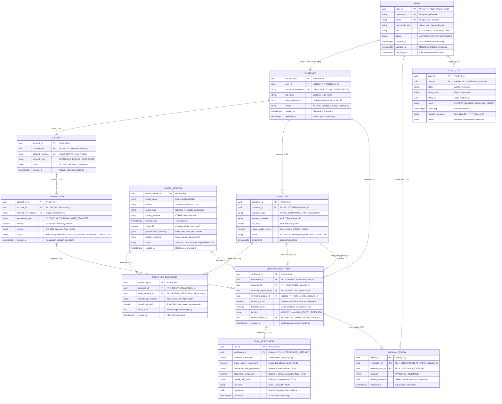

# Entity-Relationship (ER) Diagram

## 1. System Overview

This ER diagram models the complete operational, biometric, and risk assessment lifecycle for the **Intelligent Signature Verification & Fraud Risk Assessment System for Banking Transactions**.

It guarantees strict relational integrity between system security users, retail/commercial bank customers, multi-currency accounts, transactions, biometric signature specimens, versioned ML embeddings, automated risk assessments, manual compliance reviews, and immutable audit logs.

---

## 2. Mermaid ER Diagram

---

## 3. Relationship Cardinality Breakdown

1. **USER (1) to CUSTOMER (0..1):** A user account may represent an internal bank officer/admin (no customer profile) or a retail customer. A customer may be an offline entity without online credentials.
2. **CUSTOMER (1) to ACCOUNT (1..N):** A bank customer may open multiple accounts (Checking, Savings, Corporate).
3. **CUSTOMER (1) to SIGNATURE (1..N):** A customer maintains multiple signatures over time (baseline enrolled specimens and historical submission specimens).
4. **SIGNATURE (1) to SIGNATURE_EMBEDDING (1..N):** When new model versions are deployed, an enrolled signature can be re-embedded under the new model without re-requesting the physical specimen.
5. **MODEL_VERSION (1) to SIGNATURE_EMBEDDING (1..N):** Each embedding is irrevocably bound to the specific model version that created it.
6. **ACCOUNT (1) to TRANSACTION (1..N):** An account is the ledger container for transactions.
7. **TRANSACTION (1) to VERIFICATION_ATTEMPT (1..N):** High-risk or re-attempted transactions may trigger verification checks.
8. **CUSTOMER (1) to VERIFICATION_ATTEMPT (1..N):** Directly identifies the claiming customer identity being verified.
9. **VERIFICATION_ATTEMPT (1) to RISK_ASSESSMENT (1..1):** Every verification attempt receives exactly one comprehensive risk assessment.
10. **VERIFICATION_ATTEMPT (1) to MANUAL_REVIEW (0..N):** Attempts that evaluate to `MANUAL_REVIEW` are routed to compliance officers for adjudication.
11. **USER (1) to MANUAL_REVIEW (1..N):** Only users with role `OFFICER` or `ADMIN` can adjudicate reviews.
12. **MODEL_VERSION (1) to VERIFICATION_ATTEMPT (1..N):** Every verification attempt records the active model version and its decision threshold at run-time.
13. **USER (1) to AUDIT_LOG (0..N):** Tracks both user actions and automated system actions (`user_id = NULL`).
