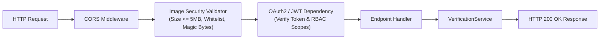

# SIGNATURE VMAKE — FastAPI Microservice Architecture

> **System:** SIGNATURE VMAKE  
> **Repository:** `signature-vmake`  
> **Document:** FastAPI Microservice Design, Routing, Security, and Schemas  
> **Version:** 2.0.0 (Production-Ready)  

---

## 1. Overview & Technology Alignment

The **SIGNATURE VMAKE** backend is built on **FastAPI**, meeting the mandatory architectural requirement specified in enterprise banking specifications (aligned with the Bank Muscat BRD technology template).

FastAPI was selected for this mission-critical banking role due to:
1. **Asynchronous Non-Blocking I/O:** Native Python `asyncio` event loop handling concurrent cheque verification requests without blocking worker threads.
2. **Strict Schema Enforcement:** Powered by Pydantic v2, ensuring every incoming payload and outgoing response is validated and strongly typed.
3. **Automated OpenAPI / Swagger Generation:** Auto-generates compliant OpenAPI 3.1.0 specifications and interactive Swagger documentation at `/docs` and ReDoc at `/redoc`.
4. **Dependency Injection:** Clean separation of database sessions, authentication contexts, and service instances.

---

## 2. Layered Microservice Structure

The backend application follows a clean layered architecture:

```
api/
├── __init__.py
├── auth.py                  # JWT authentication, password hashing, and RBAC
└── main.py                  # FastAPI app factory, routes, validation, and middleware
database/
├── models.py                # SQLAlchemy 2.0 ORM entities
├── session.py               # Database engine, sessionmaker, and get_db dependency
└── seed_demo_data.py        # Demo bank data generator
services/
├── __init__.py
└── verification_service.py  # Business logic orchestrating ML, Risk Engine, and DB
ml/
├── inference/
│   └── verify_signature.py  # Verification factory and inference entrypoint
├── models/
│   ├── model_interface.py   # Polymorphic base class and output dataclass
│   ├── siamese_network.py   # Track C (Siamese ResNet Champion)
│   └── transformer_signature_model.py # Track B (Vision Transformer)
└── baselines/
    └── classical_classifier.py # Track A (Classical Sklearn SVM)
```

---

## 3. Request Lifecycle & Middleware

Each incoming HTTP request flows through a secure multi-stage pipeline:



### 3.1 Security Validation Middleware
Implemented in `api/main.py`:
- **Allowed MIME Types & Extensions:** `.png`, `.jpg`, `.jpeg`, `.tiff`, `.bmp`.
- **Payload Size Limitation:** Enforces a strict ceiling of **5,242,880 bytes (5 MB)** per uploaded image, preventing memory exhaustion and denial-of-service (DoS) attacks.
- **Magic Byte Verification:** Inspects image header bytes (`\x89PNG`, `\xFF\xD8\xFF`, etc.) to confirm authentic binary format and reject disguised executable payloads.

### 3.2 Authentication & Authorization (`api/auth.py`)
- **Protocol:** OAuth2 with Password Grant flow and JSON Web Tokens (JWT).
- **Signing Algorithm:** HMAC-SHA256 (`HS256`) with key configured via `SIGNATURE_VMAKE_JWT_SECRET`.
- **RBAC Roles & Permissions:**
  - `teller`: Can submit verification requests and view customer verification results.
  - `fraud_analyst`: Can access risk factor breakdowns, view manual review queues, and resolve alerts.
  - `compliance_auditor`: Read-only access to immutable cryptographic audit trails and benchmark logs.
  - `system_admin`: Full administrative control, customer enrollment, and model deployment configuration.

---

## 4. Endpoints & Route Definitions

### 4.1 System Health & Diagnostics
- **`GET /api/v1/health`**
  - **Purpose:** Liveness and readiness health probe for Docker and Kubernetes orchestration.
  - **Checks:** Database connectivity, active model versions loaded, system uptime.
  - **Response:**
    ```json
    {
      "status": "HEALTHY",
      "service": "SIGNATURE VMAKE Verification Platform",
      "version": "2.0.0",
      "timestamp": "2026-09-29T17:00:00.000000",
      "database": "CONNECTED",
      "models_available": ["classical_baseline", "vision_transformer", "siamese_champion"]
    }
    ```

### 4.2 Signature Verification
- **`POST /api/v1/verifications/verify`**
  - **Method:** `POST` (Multipart form-data).
  - **Parameters:**
    - `file`: Uploaded questioned signature image (cheque or voucher scan).
    - `account_number`: Customer account number (e.g., `ACC-100482-OMR`).
    - `transaction_amount`: Float transaction value (e.g., `12500.00`).
    - `channel_type`: String identifier (`BRANCH_COUNTER`, `CTS_CLEARING`, `ATM_DEPOSIT`).
    - `model_track`: Choice of `siamese_champion` (default), `classical_baseline`, or `vision_transformer`.
    - `aggregation_strategy`: Gallery strategy (`max_similarity`, `mean_similarity`, `top_k_mean`, `centroid_distance`).
  - **Response (200 OK):**
    ```json
    {
      "verification_id": "v-9e2b1f84-18ca-429a",
      "decision": "VERIFIED",
      "similarity_score": 0.8856,
      "threshold_used": 0.7691,
      "distance": 0.2288,
      "model_version": "Siamese_ResNet_Champion_v2.0",
      "model_track": "siamese_champion",
      "risk_assessment": {
        "composite_risk_score": 0.1245,
        "risk_level": "LOW",
        "factor_breakdown": {
          "biometric_deficit": 0.1144,
          "image_quality_deficit": 0.0520,
          "monetary_risk": 0.1800,
          "behavioral_risk": 0.1000
        },
        "flags": []
      },
      "execution_time_ms": 42.1,
      "timestamp": "2026-09-29T17:00:00.000000"
    }
    ```

### 4.3 Signature Specimen Enrollment
- **`POST /api/v1/signatures/enroll`**
  - **Method:** `POST` (Multipart form-data).
  - **Parameters:**
    - `customer_id`: Unique customer identifier.
    - `file`: Genuine reference signature specimen.
    - `specimen_source`: Origin descriptor (`MANDATE_CARD`, `BRANCH_PAD`, `ONBOARDING_SCAN`).
  - **Response (201 Created):**
    ```json
    {
      "specimen_id": "spec-4819a3b0",
      "customer_id": "cust-8491",
      "sha256_hash": "a1b2c3d4e5f6...",
      "status": "ACTIVE",
      "created_at": "2026-09-29T17:00:00.000000"
    }
    ```

### 4.4 Model Comparison & Benchmark
- **`GET /api/v1/models/benchmark`**
  - **Purpose:** Delivers live empirical evaluation results comparing all three ML tracks across the validation cohort.
  - **Response (200 OK):**
    ```json
    {
      "benchmark_suite": "SIGNATURE VMAKE Three-Track Open-Set Evaluation",
      "dataset": "CEDAR Benchmark (Disjoint Validation Cohort Writers 36-45)",
      "num_pairs": 400,
      "champion_track": "Track C (Siamese ResNet Champion)",
      "results": {
        "Track A (Classical Sklearn SVM)": {
          "auc_roc": 0.8423,
          "eer": 0.23,
          "accuracy": 0.7675,
          "far": 0.2304,
          "frr": 0.2347,
          "f1_score": 0.7634,
          "optimal_threshold": 0.499,
          "latency_ms": 7.3,
          "model_size_mb": 5.4
        },
        "Track B (HF Vision Transformer)": {
          "auc_roc": 0.8118,
          "eer": 0.245,
          "accuracy": 0.755,
          "far": 0.2451,
          "frr": 0.2449,
          "f1_score": 0.7513,
          "optimal_threshold": 0.4287,
          "latency_ms": 38.4,
          "model_size_mb": 21.7
        },
        "Track C (Siamese ResNet Champion)": {
          "auc_roc": 0.9008,
          "eer": 0.1874,
          "accuracy": 0.815,
          "far": 0.1912,
          "frr": 0.1786,
          "f1_score": 0.8131,
          "optimal_threshold": 0.7691,
          "latency_ms": 42.1,
          "model_size_mb": 43.2
        }
      }
    }
    ```

### 4.5 Regulatory Audit Trail
- **`GET /api/v1/audit/trail/{identifier}`**
  - **Parameters:** `identifier` can be a `verification_id`, `account_number`, or `customer_id`.
  - **Response (200 OK):** Array of immutable cryptographic audit records detailing timestamps, actors, input hashes, similarity scores, risk ratings, and officer reviews.

---

## 5. Error Handling & Security Hardening

1. **Information Leakage Prevention:** Internal Python stack traces and database error codes are caught by global exception handlers. Clients receive sanitized RFC-7807 compliant problem details:
   ```json
   {
     "error": "BAD_REQUEST",
     "message": "Uploaded file exceeds maximum permitted size of 5 MB.",
     "timestamp": "2026-09-29T17:00:00.000000"
   }
   ```
2. **CORS Hardening:** Configured with explicit origins, disallowed wildcards for authenticated credentials, and restricted HTTP verbs (`GET`, `POST`, `OPTIONS`).
3. **Database Concurrency:** Uses thread-safe SQLAlchemy scoped sessions (`get_db`) with automatic commit on success and rollback on exceptions.
