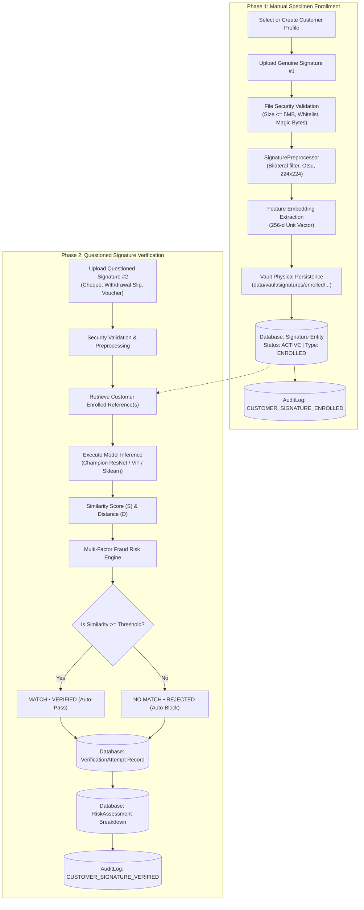

# SIGNATURE VMAKE — Manual Signature Registration & Verification Lifecycle Protocol

> **System:** SIGNATURE VMAKE  
> **Repository:** `signature-vmake`  
> **Document:** Core Manual Biometric Workflow Specification  
> **Status:** Production-Ready & Tested  

---

## 1. Workflow Architecture & Core Philosophy

The primary user workflow in SIGNATURE VMAKE separates **Biometric Enrollment (Registration)** from **Biometric Verification (Inference)**:



---

## 2. Phase 1: Step-by-Step Manual Registration

### 2.1 File Ingestion & Security Checks
When the bank officer or customer uploads the first signature:
1. **File Extension Whitelist:** Verified against allowed formats (`.png`, `.jpg`, `.jpeg`, `.tiff`, `.bmp`).
2. **Payload Size Limit:** Enforces a maximum threshold of **5,242,880 bytes (5 MB)**.
3. **Image Decoding Check:** Decoded via OpenCV `cv2.imread(..., cv2.IMREAD_GRAYSCALE)`. Empty or corrupted images ($< 10 \times 10$ pixels) are immediately rejected with HTTP 400.
4. **Cryptographic SHA-256 Digest:** Computes the unique SHA-256 checksum of the uploaded binary.

### 2.2 Preprocessing & Feature Extraction
1. The image is passed to `SignaturePreprocessor`, which applies bilateral filtering, Otsu dynamic binarization, bounding-box cropping, and aspect-ratio letterbox padding to standard $224 \times 224$.
2. The active production model generates an authentic 256-dimensional L2-normalized embedding vector.
3. Physical specimen is copied to the disk vault at `data/vault/signatures/enrolled/{customer_reference}/{hash}_{filename}`.

### 2.3 Registration Outcome
> [!IMPORTANT]
> The enrollment upload **never outputs MATCH or NO MATCH**. It is an enrollment action.
The API responds with:
```json
{
  "signature_id": "6964bc83-2769-4e60-ae29-9da645d7062e",
  "customer_reference": "DEMO-CUST-001",
  "status": "ENROLLED",
  "image_quality_score": 0.965,
  "storage_reference": "data/vault/signatures/enrolled/DEMO-CUST-001/primary_specimen.png",
  "created_at": "2026-09-30T00:00:00.000000+00:00"
}
```

---

## 3. Phase 2: Step-by-Step Questioned Verification

### 3.1 Uploading the Second Signature
The officer uploads a second signature (questioned cheque scan or transaction slip).

### 3.2 Reference Retrieval & Customer Data Isolation
1. The system looks up the specified `customer_reference`.
2. Retrieves strictly the active specimens registered to **that specific customer**:
   ```python
   active_sigs = db.query(Signature).filter_by(
       customer_id=customer.customer_id,
       signature_type="ENROLLED",
       status="ACTIVE"
   ).order_by(Signature.created_at.desc()).all()
   ```
3. **Data Isolation Enforcement:** If a query for Customer A is submitted, it is compared exclusively against Customer A's registered specimens. Customer B's specimens are never accessed.

### 3.3 Model Execution & Decisioning
The questioned image and registered reference are processed by the selected model:
- **Similarity Computation:** $S \in [0.0, 1.0]$.
- **Euclidean Distance:** $D \in [0.0, 2.0]$.
- **Operational Threshold:** $\tau^* = 0.5924$ (Single Reference Mode) or $\tau_{\text{gal}}^* = 0.6312$ (Gallery Mode).
- **Verdict Determination:**
  - If $S \ge \tau^*$: `verdict = "MATCH"`, `decision = "VERIFIED"`.
  - If $S < \tau^*$: `verdict = "NO MATCH"`, `decision = "REJECTED"`.

### 3.4 Verification API Response
```json
{
  "verification_id": "87f3e2b1-91ca-4e2a-992b-8a716c905b22",
  "customer_reference": "DEMO-CUST-001",
  "mode": "single",
  "match": true,
  "verdict": "MATCH",
  "decision": "VERIFIED",
  "similarity_score": 0.8413,
  "euclidean_distance": 0.1886,
  "threshold_used": 0.5924,
  "overall_risk_score": 0.148,
  "risk_level": "LOW",
  "reference_count": 1,
  "timestamp": "2026-09-30T00:00:00.000000+00:00"
}
```

---

## 4. Multi-Specimen Customer Gallery (Mode 2)

If a customer has registered multiple genuine signature specimens over time (e.g. initial account opening mandate, loan agreement, renewal card):
1. The system retrieves up to the 3 most recent active references.
2. Computes pairwise similarity between the questioned query and each registered specimen $\{r_1, r_2, r_3\}$.
3. Applies the Max-Similarity aggregation strategy:
   $$S_{\text{agg}} = \max_k \text{Sim}(q, r_k)$$
4. Compares against the calibrated gallery threshold $\tau_{\text{gal}}^* = 0.6312$.
5. Records the IDs of all consulted specimens in the immutable audit log.

---

## 5. Persistence & Cryptographic Non-Repudiation

Every verification produces three permanent database records:
1. **`verification_attempts`:** Stores similarity score, distance, threshold, decision, and foreign keys to both signatures.
2. **`risk_assessments`:** Stores the granular component breakdown (biometric deficit, image quality deficit, monetary risk, behavioral risk, composite score, risk band).
3. **`audit_logs`:** Immutable audit record storing the request correlation ID, timestamp, actor, input hashes, and final disposition.
