# SIGNATURE VMAKE — Production Manual Signature Registration & Verification Workflow Guide

> [!NOTE]
> This guide documents the end-to-end production manual signature registration and verification workflow implemented in SIGNATURE VMAKE. The system provides robust customer-conditioned biometric authentication, disk vault persistence, multi-specimen gallery verification, and immutable regulatory audit trails.

---

## 1. Executive Summary & Workflow Architecture

The SIGNATURE VMAKE manual verification subsystem enables bank customers, compliance officers, and tellers to register genuine reference signature specimens and verify questioned signatures against registered customer galleries in real time.

The system enforces strict separation between **Reference Registration (Enrollment)** and **Questioned Verification (Querying)**:
1. **Enrollment (Step 1)**: Accepts a Customer ID and a genuine signature file. The image is strictly validated, preprocessed, physically persisted to a disk vault, indexed in PostgreSQL / SQLite, embedded via the frozen Siamese Champion model, and marked as an `ACTIVE` enrolled specimen. **The first upload is strictly a reference and never generates a verification verdict.**
2. **Verification (Step 2)**: Accepts a Customer ID and a questioned signature file. The system retrieves the customer's active enrolled reference(s), executes Siamese neural inference with frozen calibration thresholds, computes a non-exaggerated binary `MATCH` / `NO MATCH` decision, evaluates multi-factor fraud risk, and records an immutable audit trail.

```mermaid
sequenceDiagram
    autonumber
    actor User as User / Customer
    participant Web as Web Dashboard
    participant API as FastAPI REST Gateway
    participant Service as BankingVerificationService
    participant Vault as Secure Disk Vault
    participant Net as Siamese ResNet-18 Champion
    participant DB as Relational Ledger (DB)

    rect rgb(20, 35, 45)
    note right of User: STEP 1: Genuine Reference Registration
    User->>Web: Input Customer ID + Upload Genuine Signature
    Web->>API: POST /api/v1/signatures/enroll (multipart/form-data)
    API->>Service: enroll_customer_signature(customer_reference, image_path)
    Service->>Service: Validate extension, size (<=5MB), decode image
    Service->>Vault: Persist specimen to data/vault/signatures/enrolled/
    Service->>Net: extract_embedding() -> 256-d unit vector
    Service->>DB: INSERT signatures (ENROLLED, ACTIVE) + signature_embeddings
    Service->>DB: INSERT audit_logs (CUSTOMER_SIGNATURE_ENROLLED)
    Service-->>Web: Return registration payload (signature_id, quality, hash)
    Web-->>User: Display Registered Specimen in Gallery Card
    end

    rect rgb(30, 25, 45)
    note right of User: STEP 2: Questioned Signature Verification
    User->>Web: Select Customer + Mode (Single / Gallery) + Upload Questioned Sig
    Web->>API: POST /api/v1/verifications/verify
    API->>Service: verify_customer_signature(customer_ref, mode, query_path)
    Service->>DB: SELECT active enrolled signatures for Customer ID
    Service->>Vault: Persist questioned image to submissions vault
    Service->>Net: verify() [Single: tau*=0.5924] OR verify_gallery() [Gallery: tau_gal*=0.6312]
    Net-->>Service: Return similarity S, euclidean distance D
    Service->>Service: Verdict: MATCH if S >= tau, else NO MATCH
    Service->>Service: FraudRiskEngine.evaluate(S, quality, amount, channel)
    Service->>DB: INSERT transactions + verification_attempts + risk_assessments + audit_logs
    Service-->>Web: Return decision (MATCH/NO MATCH, S, tau*, D, verification_id)
    Web-->>User: Display Biometric Verdict Banner & Metric Breakdown
    end
```



---

## 2. Step 1 — Register a Genuine Signature

### 2.1 Customer ID Context & Vault Siloing
- Each registered specimen is conditioned on the `customer_reference` (or UUID `customer_id`).
- When a customer reference is provided, the system retrieves or auto-provisions the customer profile and financial account, guaranteeing complete data isolation between accounts.
- Customer A's specimens cannot be accessed, consulted, or compared against Customer B's verifications.

### 2.2 Strict Input Validation & Security Safeguards
All uploads pass through multi-layer defensive validation:
1. **File Size Enforcement**: Files exceeding 5 MB (`5,242,880 bytes`) are immediately rejected with HTTP `413 Payload Too Large`.
2. **Format Whitelist**: Only `.png`, `.jpg`, `.jpeg`, `.tiff`, and `.bmp` files are accepted. Unwhitelisted extensions (e.g. `.exe`, `.sh`, `.pdf`) are rejected with HTTP `400 Bad Request`.
3. **Image Decoding & Integrity Check**: Raw bytes are decoded using OpenCV (`cv2.imread(..., cv2.IMREAD_GRAYSCALE)`). If bytes are corrupt, unparseable, empty, or dimensions are smaller than $10 \times 10$ pixels, HTTP `400 Bad Request` is returned with `Corrupt or invalid signature image`.

### 2.3 Image Preprocessing Pipeline
Enrolled specimens undergo standard biometric preprocessing before feature extraction:
- **Grayscale Normalization**: Standardizes dynamic luminance range.
- **Otsu Automatic Binarization**: Dynamically segments ink strokes from paper substrate.
- **Aspect-Preserving Resize & Padding**: Formatted to $224 \times 224$ pixels conforming to Siamese ResNet input geometry.

### 2.4 Physical Disk Vault Storage
Uploaded files are saved to the persistent local filesystem vault:
- **Path Pattern**: `data/vault/signatures/enrolled/{customer_reference}/{hash[:8]}_{filename}`
- Physical files remain on disk for inspection, UI thumbnail serving, and repeatable inference.

### 2.5 Database Persistence & Embedding Extraction
- **`signatures` table**: `signature_type = 'ENROLLED'`, `status = 'ACTIVE'`, `storage_reference = <vault_path>`, `image_quality_score`, `file_hash` (SHA-256).
- **`signature_embeddings` table**: 256-dimensional unit-norm L2 feature vector extracted by `v4_champion_model.pt`, indexed under active production model ID.
- **`audit_logs` table**: Immutable log entry recording action `CUSTOMER_SIGNATURE_ENROLLED` with cryptographic hash and timestamp.

> [!IMPORTANT]
> The initial registration upload creates solely an enrolled reference record. It **does not** create a verification attempt or generate a match score.

---

## 3. Step 2 — Verify a Questioned Signature

### 3.1 Verification Modes & Frozen Calibrated Thresholds

The system provides two verification modes based on the SIGNATURE VMAKE experimentation protocol:

| Verification Mode | Reference Gallery Size | Aggregation Strategy | Frozen Calibrated Threshold | Primary Use Case |
| :--- | :---: | :---: | :---: | :--- |
| **Mode 1: Single Reference** | 1 (Latest active) | Direct Pair Comparison | $\tau^* = 0.5924$ | Quick single specimen verification, initial accounts |
| **Mode 2: Customer Gallery** | Up to 3 active specimens | Max Similarity ($S_{\text{max}} = \max_i S_i$) | $\tau_{\text{gal}}^* = 0.6312$ | High-security banking, skilled-forgery suppression |

### 3.2 Verification Flow & Execution
1. **Retrieve Enrolled References**: Looks up all `status = 'ACTIVE'` and `signature_type = 'ENROLLED'` specimens for the given customer. If none exist, the API rejects with HTTP `400` ("No active enrolled signatures found for customer...").
2. **Persist Questioned Specimen**: Validates and copies the submitted image to `data/vault/signatures/submissions/{customer_reference}/`.
3. **Execute Neural Inference**:
   - **Mode 1**: Evaluates distance $D = \|f(\text{ref}) - f(\text{query})\|_2$ and similarity $S = \frac{1}{1 + D}$.
   - **Mode 2**: Evaluates distance to all active specimens (up to 3) and extracts maximum similarity $S_{\text{max}}$.
4. **Binary Verdict Determination**:
   $$\text{Verdict} = \begin{cases} \text{MATCH} & \text{if } S \ge \tau^* \\ \text{NO MATCH} & \text{if } S < \tau^* \end{cases}$$
5. **Multi-Factor Fraud Risk Engine**: Combines biometric discrepancy ($1 - S$), image quality score, monetary amount, and transaction channel into a composite score $\in [0, 1]$.
6. **Ledger Record & Audit Trail**: Persists `Transaction`, `VerificationAttempt`, `RiskAssessment`, and `AuditLog`.

---

## 4. Customer Reference Gallery Management

### 4.1 Multi-Specimen Gallery Cards
The web studio dynamically displays up to 3 active reference cards for the selected customer, showing:
- Real thumbnail image served from vault (`/api/v1/signatures/{id}/image`).
- Image quality score percentage (e.g. $94.2\%$).
- Specimen UUID.
- Active status badge (`ACTIVE` in green, `SUPERSEDED` in slate).
- One-click specimen deactivation button.

### 4.2 Specimen Deactivation (Soft-Delete)
- When a specimen is replaced or revoked, clicking **Deactivate** calls `POST /api/v1/signatures/{id}/deactivate`.
- The record status transitions to `'SUPERSEDED'`.
- The physical file and database records remain intact to preserve regulatory non-repudiation.
- Deactivated specimens are excluded from future verification comparisons.

---

## 5. REST API Reference

### 5.1 Enroll Genuine Signature
`POST /api/v1/signatures/enroll` (or `/signatures/enroll`)

**Request**: `multipart/form-data`
- `customer_reference`: `str` (required, e.g. `DEMO-CUST-001`)
- `signature_file`: binary file (required, PNG/JPG/TIFF)

**Response (`200 OK`)**:
```json
{
  "signature_id": "c1f8a84b-0123-4567-89ab-cdef01234567",
  "customer_reference": "DEMO-CUST-001",
  "image_quality_score": 0.9421,
  "file_hash": "a1b2c3d4e5...",
  "status": "ENROLLED",
  "active_status": "ACTIVE",
  "storage_reference": "data/vault/signatures/enrolled/DEMO-CUST-001/c1f8a84b_specimen.png",
  "created_at": "2026-09-29T13:45:00.000000+00:00"
}
```

### 5.2 List Customer Reference Specimens
`GET /api/v1/customers/{customer_id}/signatures` (or `/api/v1/signatures/customer/{customer_id}`)

**Response (`200 OK`)**:
```json
{
  "customer_reference": "DEMO-CUST-001",
  "customer_name": "Customer DEMO-CUST-001",
  "total_count": 2,
  "active_count": 2,
  "signatures": [
    {
      "signature_id": "c1f8a84b-0123-4567-89ab-cdef01234567",
      "customer_reference": "DEMO-CUST-001",
      "signature_type": "ENROLLED",
      "storage_reference": "data/vault/signatures/enrolled/DEMO-CUST-001/c1f8a84b_specimen.png",
      "file_hash": "a1b2c3d4...",
      "image_quality_score": 0.9421,
      "status": "ACTIVE",
      "is_active": true,
      "created_at": "2026-09-29T13:45:00.000000+00:00",
      "image_url": "/api/v1/signatures/c1f8a84b-0123-4567-89ab-cdef01234567/image"
    }
  ]
}
```

### 5.3 Serve Specimen Image
`GET /api/v1/signatures/{signature_id}/image`

**Response (`200 OK`)**:
- Binary image data with header `Content-Type: image/png`.

### 5.4 Deactivate Specimen
`POST /api/v1/signatures/{signature_id}/deactivate`

**Response (`200 OK`)**:
```json
{
  "signature_id": "c1f8a84b-0123-4567-89ab-cdef01234567",
  "customer_reference": "DEMO-CUST-001",
  "status": "SUPERSEDED",
  "message": "Signature specimen deactivated successfully."
}
```

### 5.5 Verify Questioned Signature
`POST /api/v1/verifications/verify` (or `/verifications/verify`)

**Request**: `multipart/form-data`
- `submitted_signature`: binary file (required)
- `customer_reference`: `str` (required for manual verification)
- `mode`: `"single"` or `"gallery"` (default: `"single"`)
- `threshold`: `float` (optional override)

**Response (`200 OK`)**:
```json
{
  "verification_id": "8f3e2b1a-9876-5432-10fe-dcba98765432",
  "customer_reference": "DEMO-CUST-001",
  "mode": "single",
  "match": true,
  "verdict": "MATCH",
  "decision": "VERIFIED",
  "similarity_score": 0.7812,
  "threshold_used": 0.5924,
  "euclidean_distance": 0.2801,
  "reference_count": 1,
  "references_used": ["c1f8a84b-0123-4567-89ab-cdef01234567"],
  "overall_risk_score": 0.1245,
  "risk_level": "LOW",
  "risk_factors": ["LOW_BIOMETRIC_DISCREPANCY", "HIGH_IMAGE_QUALITY"],
  "similarity_component": 0.2188,
  "image_quality_component": 0.0579,
  "transaction_status": "VERIFIED",
  "timestamp": "2026-09-29T13:46:00.000000+00:00",
  "request_reference": "REQ-7E1A29D4"
}
```

---

## 6. Automated Verification & Quality Assurance

The implementation includes dedicated unit and integration tests located in `tests/test_manual_workflow.py`. All tests run without external network access or mocking:

```bash
python -m pytest tests/test_manual_workflow.py -v
```

### Test Coverage Matrix

| Test Identifier | Validated Capability | Result |
| :--- | :--- | :---: |
| `test_manual_registration_success` | Step 1 enrollment, disk vault write, quality score, DB persistence | `PASSED` |
| `test_first_upload_is_strictly_reference_not_verification` | First upload registers reference without triggering verification | `PASSED` |
| `test_manual_registration_corrupt_file_rejected` | Corrupt raw bytes rejected with HTTP 400 Bad Request | `PASSED` |
| `test_manual_registration_invalid_extension_rejected` | Disallowed file extension (`.sh`) rejected with HTTP 400 | `PASSED` |
| `test_manual_registration_oversized_file_rejected` | Payload > 5MB rejected with HTTP 413 | `PASSED` |
| `test_get_customer_signatures_gallery_and_image_endpoint` | Retrieval of customer gallery and physical image byte serving | `PASSED` |
| `test_deactivate_specimen_soft_delete` | Status update to `SUPERSEDED` and audit log creation | `PASSED` |
| `test_verify_without_enrolled_signature_fails` | Rejection when customer has 0 active references | `PASSED` |
| `test_manual_verification_single_reference_match` | Mode 1 ($\tau^* = 0.5924$) genuine pair yields `MATCH` | `PASSED` |
| `test_manual_verification_single_reference_no_match` | Mode 1 skilled forgery rejection yields `NO MATCH` | `PASSED` |
| `test_manual_verification_gallery_mode_multi_specimen` | Mode 2 ($\tau_{\text{gal}}^* = 0.6312$) multi-specimen gallery | `PASSED` |
| `test_customer_isolation_security` | Strict customer siloing: Customer B cannot verify against Customer A | `PASSED` |

Full test suite verification: **41/41 tests passing across the entire project**.
