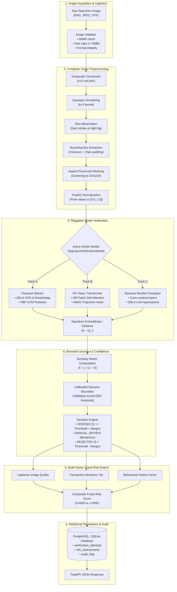

# SIGNATURE VMAKE — Machine Learning Pipeline Architecture

**Document Version:** 1.0.0  
**Project:** SIGNATURE VMAKE (`signature-vmake`)  
**Domain:** End-to-End Biometric Verification & Fraud Assessment Pipeline  

---

## 1. High-Level Pipeline Flowchart

The end-to-end pipeline in SIGNATURE VMAKE coordinates data processing, representation learning, multi-factor risk evaluation, and database auditing:

---

## 2. Preprocessing & Normalization Protocol

Implemented in [`ml/preprocessing/signature_preprocessor.py`](file:///c:/Users/ASUS/Downloads/hcl/ml/preprocessing/signature_preprocessor.py):
1. **Grayscale Standardization:** Converts RGBA, RGB, or indexed scans to single-channel 8-bit grayscale with alpha blending against a synthetic white background.
2. **Noise Reduction:** Applies a $3 \times 3$ Gaussian blur to eliminate scanner sensor grain without smearing delicate stroke endpoints.
3. **Adaptive / Otsu Binarization:** Automatically calculates the optimal bimodal gray-level split threshold to cleanly isolate foreground ink from paper backgrounds.
4. **Bounding Box Isolation:** Identifies connected stroke contours, crops tightly around the outer bounding box with a 10-pixel safety margin to discard dead white space.
5. **Aspect-Ratio Preserved Resizing:** Scales the cropped signature proportionally to fit within a $224 \times 224$ canvas, centering with padding to prevent artificial geometric distortion.
6. **Float32 Normalization:** Maps pixel intensities to the interval $[0.0, 1.0]$.

---

## 3. Pluggable Model Architecture

All model tracks implement the abstract base class [`ml/models/model_interface.py`](file:///c:/Users/ASUS/Downloads/hcl/ml/models/model_interface.py):
* `extract_features(image) -> np.ndarray`
* `compute_distance(feat1, feat2) -> float`
* `compute_similarity(distance) -> float`
* `verify_pair(ref, query, threshold) -> VerificationOutput`
* `verify_gallery(gallery, query, strategy, threshold) -> VerificationOutput`

### 3.1 Multiple Reference Galleries
When a bank customer registers multiple signature specimens ($N \ge 1$), evidence is aggregated via:
- **Maximum Similarity (`max_similarity`):** Optimistic matching against the customer's best specimen.
- **Mean Similarity (`mean_similarity`):** Smooths natural intra-signer variance across all specimens.
- **Top-$K$ Mean (`top_k_mean`):** Averages the top 2 closest specimens.
- **Centroid Distance (`centroid_distance`):** Computes Euclidean distance against the unit-normalized gallery centroid.

---

## 4. Multi-Factor Banking Fraud Risk Engine

The system does not rely exclusively on biometrics. The business risk engine ([`services/risk_engine.py`](file:///c:/Users/ASUS/Downloads/hcl/services/risk_engine.py)) combines 4 orthogonal vectors:

$$R_{\text{composite}} = w_{\text{bio}} R_{\text{bio}} + w_{\text{qual}} R_{\text{qual}} + w_{\text{txn}} R_{\text{txn}} + w_{\text{beh}} R_{\text{beh}}$$

where:
* $R_{\text{bio}} = 1.0 - S_{\text{biometric}}$ (biometric dissimilarity).
* $R_{\text{qual}} = 1.0 - Q_{\text{image}}$ (Laplacian blur variance and contrast penalty).
* $R_{\text{txn}}$: Transaction amount risk (e.g. $\$100\text{k}+$ wire transfers vs $\$50$ counter cheques).
* $R_{\text{beh}}$: Velocity and historical anomaly penalty.
* Weights: $w_{\text{bio}} = 0.50$, $w_{\text{qual}} = 0.15$, $w_{\text{txn}} = 0.25$, $w_{\text{beh}} = 0.10$.
