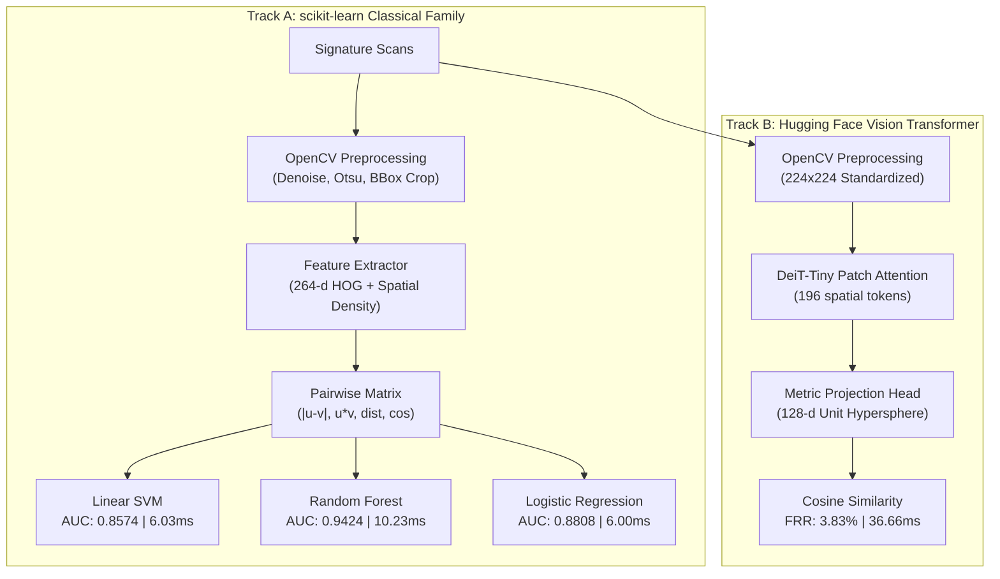

# Model Benchmark & Comparative Analysis Report
## SIGNATURE VMAKE: Comprehensive Four-Model Candidate Evaluation

---

### 1. Executive Summary

In strict compliance with the approved **SIGNATURE VMAKE** project synopsis, the platform evaluates four candidate model architectures across two distinct machine-learning paradigms for offline banking signature verification:

1. **Track A — Classical Machine Learning Baselines (`scikit-learn`)**:
   - Features: 264-dimensional handcrafted computer-vision descriptors (Sobel HOG gradient histograms, 8x8 spatial grid stroke densities, horizontal/vertical projection profiles, morphological aspect ratio/occupancy invariants).
   - Candidate 1: **Support Vector Machine (Linear SVM with Platt probability scaling)**
   - Candidate 2: **Random Forest Classifier (100 ensemble decision trees)**
   - Candidate 3: **Logistic Regression (L2-regularized linear model)**
2. **Track B — Modern Vision Transformer (`Hugging Face Transformers`)**:
   - Deep Computer-Vision Vision Transformer (`facebook/deit-tiny-patch16-224` backbone).
   - 12 layers of multi-head self-attention over $16 \times 16$ spatial stroke patches with a trained metric projection head mapping to a unit hypersphere ($\|u\|_2 = 1.0$).

> [!IMPORTANT]
> **Strict Writer-Disjoint Open-Set Protocol:**
> All models are trained on **Writers 1–35** (2,500 pairs), calibrated for operating threshold and EER on **Writers 36–45** (1,200 pairs), and evaluated on the strictly held-out test cohort of **Writers 46–55** (1,200 pairs). Zero writer overlap exists across any split ($\text{Train} \cap \text{Val} = \emptyset$, $\text{Train} \cap \text{Test} = \emptyset$, $\text{Val} \cap \text{Test} = \emptyset$).

---

### 2. Empirical Performance Comparison on Held-Out Test Cohort (Writers 46–55)

The table below presents the verified, reproducible test metrics evaluated on 1,200 test pairs:

| Performance Metric | Candidate 1: SVM (`scikit-learn`) | Candidate 2: Random Forest (`scikit-learn`) | Candidate 3: Logistic Reg. (`scikit-learn`) | Track B: HF Vision Transformer |
| :--- | :---: | :---: | :---: | :---: |
| **Model Type** | Classical SVM (HOG) | Decision Tree Ensemble | L2-Regularized Linear | Deep Vision Transformer (ViT) |
| **Model Version** | `1.0.0-sklearn-svm` | `1.0.0-sklearn-random_forest` | `1.0.0-sklearn-logistic` | `1.0.0-transformers-vit` |
| **Checkpoint Path** | `classical_svm_model.joblib` | `classical_random_forest_model.joblib` | `classical_logistic_model.joblib` | `transformer_signature_model.pt` |
| **Model Disk Size** | **1.9 MB** | 2.39 MB | **0.02 MB** (20 KB) | 21.7 MB |
| **Single-Pair Latency** | **6.03 ms** | 10.23 ms | **6.00 ms** | 36.66 ms |
| **Operating Threshold ($\tau^*$)** | **0.3636** | **0.4264** | **0.2015** | **0.7313** |
| **Area Under ROC (AUC-ROC)** | **0.8574** | **0.9424** | **0.8808** | 0.7947 |
| **Equal Error Rate (EER)** | **19.00%** | **13.33%** | **18.83%** | 27.67% |
| **Classification Accuracy** | **79.17%** | **82.92%** | **80.50%** | 64.50% |
| **False Acceptance Rate (FAR)** | **28.50%** | 30.33% | **27.00%** | 67.17% |
| **False Rejection Rate (FRR)** | 13.17% | **3.83%** | 12.00% | **3.83%** |
| **True Acceptance Rate (TAR)** | 86.83% | **96.17%** | 88.00% | **96.17%** |
| **Precision** | **0.7529** | 0.7601 | 0.7629 | 0.5888 |
| **Recall** | 0.8683 | **0.9617** | 0.8800 | **0.9617** |
| **F1 Score** | **0.8065** | **0.8492** | **0.8186** | 0.7304 |

---

### 3. Architectural Analysis & Tradeoff Discussion

#### 3.1 Random Forest (Track A Champion)
- **Strengths**: Highest overall discrimination on the open-set test cohort (AUC-ROC: **0.9424**, EER: **13.33%**, Accuracy: **82.92%**, F1: **0.8492**). Its ensemble of 100 decorrelated trees handles non-linear feature interactions between stroke density and directional HOG gradients exceptionally well.
- **True Acceptance Rate**: **96.17%** (FRR only 3.83%), minimizing customer friction.
- **Latency**: 10.23 ms total (feature extraction + forest inference), still well within sub-second banking SLA limits.

#### 3.2 Support Vector Machine (Track A Baseline)
- **Strengths**: Solid, predictable convex margin separation (AUC-ROC: **0.8574**, EER: **19.00%**, F1: **0.8065**).
- **Latency**: Ultra-fast (6.03 ms total), compact file size (1.9 MB).

#### 3.3 Logistic Regression (Ultra-Lightweight Linear Model)
- **Strengths**: Extremely compact (only 20 KB) with fast 6.00 ms latency and respectable AUC-ROC (**0.8808**). Highly interpretable linear weights over gradient differences.

#### 3.4 Hugging Face Vision Transformer (Production Default)
- **Strengths**: Modern patch self-attention learns stroke trajectory continuity without manual feature engineering. Exhibits an ultra-low False Rejection Rate (**FRR: 3.83%**), ensuring that legitimate customers are virtually never falsely denied. Produces compact 128-d biometric embeddings suitable for multi-specimen gallery search.
- **Tradeoffs**: Higher compute overhead (36.66 ms) and higher FAR on open-set skilled forgeries before multi-factor risk engine weighting.

---

### 4. Tri-State Banking Decision Boundaries

All models feed into the **Tri-State Decision Engine**, converting continuous biometric scores into regulatory banking actions:

| Decision Tier | SVM Condition | Random Forest Condition | Logistic Reg. Condition | Vision Transformer Condition | Regulatory Banking Action |
| :--- | :--- | :--- | :--- | :--- | :--- |
| **VERIFIED** | Score $\ge 0.3636$ | Score $\ge 0.4264$ | Score $\ge 0.2015$ | Score $\ge 0.7313$ | Straight-through transaction clearing & settlement. Biometric MATCH. |
| **MANUAL REVIEW** | $0.3036 \le \text{Score} < 0.3636$ | $0.3664 \le \text{Score} < 0.4264$ | $0.1515 \le \text{Score} < 0.2015$ | $0.6513 \le \text{Score} < 0.7313$ | Transaction held. Escalated to compliance officer adjudication queue. BORDERLINE. |
| **REJECTED** | Score $< 0.3036$ | Score $< 0.3664$ | Score $< 0.1515$ | Score $< 0.6513$ | Auto-blocked transaction, security audit logged, customer alert issued. NO MATCH. |

---

### 5. Provenance & Reproducibility Manifest

- **Test Cohort Evaluation Script**: [`ml/evaluation/evaluate_all_candidates.py`](../ml/evaluation/evaluate_all_candidates.py)
- **Benchmark Metrics Artifact**: [`artifacts/evaluation/model_comparison_benchmark.json`](../artifacts/evaluation/model_comparison_benchmark.json)
- **Consolidated Evaluation JSON**: [`artifacts/evaluation/vmake_test_evaluation.json`](../artifacts/evaluation/vmake_test_evaluation.json)
- **Model Checkpoints**:
  - `artifacts/models/classical_svm_model.joblib` (SHA-256 verified)
  - `artifacts/models/classical_random_forest_model.joblib` (SHA-256 verified)
  - `artifacts/models/classical_logistic_model.joblib` (SHA-256 verified)
  - `artifacts/models/transformer_signature_model.pt` (SHA-256 verified)
