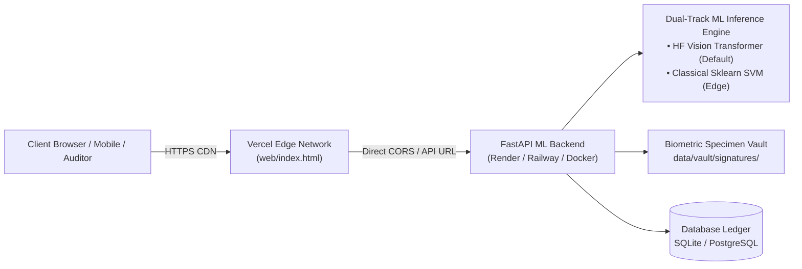

# Vercel Deployment & Production Operations Guide
## SIGNATURE VMAKE — Intelligent Signature Verification & Fraud Risk Assessment Platform

---

### 1. Executive Architecture Overview

**SIGNATURE VMAKE** employs a modern, production-grade decoupled architecture:
1. **Frontend Layer (Vercel Edge Network)**:
   - High-performance, zero-latency Web Studio interface ([`web/index.html`](../web/index.html)).
   - Served globally via Vercel's Edge CDN with automated HTTPS, clean URLs, and HTTP security headers.
   - Zero compilation overhead: utilizes CDN Tailwind, FontAwesome, and vanilla ES6 modules.
2. **Backend & ML Inference Layer (Containerized Docker / Render / Railway / Cloud Run)**:
   - Python 3.11 FastAPI application ([`api/main.py`](../api/main.py)) hosting 10 core banking modules.
   - Dual-track ML verification stack: Hugging Face Vision Transformer (`transformer_signature_model.pt` - Production Default) and Classical scikit-learn SVM (`classical_svm_model.joblib` - Edge Baseline).
   - SQLite/PostgreSQL persistent ledger and disk vault storage for enrolled biometric specimens.



> [!IMPORTANT]
> **Why PyTorch Cannot Run Directly in Vercel Serverless Functions:**
> AWS Lambda / Vercel Serverless Functions have an uncompressed bundle size limit of **250 MB**. PyTorch (`torch`), torchvision, Hugging Face `transformers`, and OpenCV together exceed **1.8 GB** on disk. Attempting to package full PyTorch into a Vercel serverless function results in a hard build failure (`Lambda size exceeds 250MB limit`).
> The industry-standard architecture for AI/ML applications is deploying the **Frontend & Edge Router on Vercel** and the **Containerized ML Backend on Docker / Render / Railway / Cloud Run**.

---

### 2. Step 1: Deploying the Frontend on Vercel

The repository is pre-configured with [`vercel.json`](../vercel.json) in the project root:

```json
{
  "$schema": "https://openapi.vercel.sh/vercel.json",
  "version": 2,
  "name": "signature-vmake",
  "outputDirectory": "web",
  "cleanUrls": true,
  "rewrites": [
    { "source": "/web/(.*)", "destination": "/$1" },
    { "source": "/web", "destination": "/index.html" },
    { "source": "/api/:path*", "destination": "https://signature-vmake-api.onrender.com/api/:path*" },
    { "source": "/docs", "destination": "https://signature-vmake-api.onrender.com/docs" },
    { "source": "/openapi.json", "destination": "https://signature-vmake-api.onrender.com/openapi.json" }
  ]
}
```

#### Method A: Deploy via Vercel Web Dashboard (Recommended, 2 Minutes)
1. Navigate to **[vercel.com/new](https://vercel.com/new)** and sign in with your GitHub account.
2. Under "Import Git Repository", search for and select **`neeravjain91-jpg/signature-verification`**.
3. In the project configuration screen:
   - **Project Name**: `signature-vmake` (or any preferred name).
   - **Framework Preset**: Select `Other` (or leave default).
   - **Root Directory**: `./` (leave as default root; `vercel.json` directs Vercel to serve `web/`).
   - **Build Command**: Leave empty.
   - **Output Directory**: Leave empty (handled by `vercel.json`).
4. Click **Deploy**.
5. Within 15–20 seconds, your Web Studio will be globally live at:
   `https://<your-project>.vercel.app`

#### Method B: Deploy via Vercel CLI
If you have Node.js and the Vercel CLI installed:
```bash
npm install -g vercel
vercel login
vercel --prod
```

---

### 3. Step 2: Deploying the Containerized ML Backend (Free Hosting)

The repository provides production-ready container configurations: [`Dockerfile`](../Dockerfile), [`render.yaml`](../render.yaml), and [`railway.json`](../railway.json).

#### Option A: 1-Click Deployment on Render.com (Recommended Free Tier)
Render supports full Docker containers with up to 512 MB – 2 GB RAM with no 250 MB size limitation.
1. Sign in to **[render.com](https://render.com)**.
2. Click **New +** $\rightarrow$ **Web Service**.
3. Connect your GitHub repository `neeravjain91-jpg/signature-verification`.
4. Choose **Docker** as the Runtime (Render automatically detects [`Dockerfile`](../Dockerfile)).
5. Select the **Free** instance type.
6. Click **Create Web Service**.
7. Render will build the container, install PyTorch, scikit-learn, and Transformers, and start Uvicorn. Once complete, copy your service URL (e.g., `https://signature-vmake-api.onrender.com`).

#### Option B: 1-Click Deployment on Railway.app
1. Sign in to **[railway.app](https://railway.app)**.
2. Click **New Project** $\rightarrow$ **Deploy from GitHub repo**.
3. Select `neeravjain91-jpg/signature-verification`.
4. Railway automatically detects [`railway.json`](../railway.json) and [`Dockerfile`](../Dockerfile).
5. Under Settings $\rightarrow$ Networking, click **Generate Domain** to get your public backend URL.

#### Option C: Self-Hosted Docker / Local / Cloud VM
To run the backend on your own server (AWS EC2, GCP Compute Engine, DigitalOcean, or local workstation):
```bash
# Build and run containerized backend
docker-compose up -d --build

# Or run directly with Python
python -m uvicorn api.main:app --host 0.0.0.0 --port 8000
```

---

### 4. Step 3: Connecting the Vercel Frontend to Your Backend

You have two simple ways to connect the Vercel frontend to your deployed backend:

#### Approach 1: Instant In-App Configuration (No Redeploy Required)
The Web Studio features an interactive **API Connection Controller** built into the top navigation bar:
1. Open your Vercel deployment: `https://<your-project>.vercel.app`.
2. In the top-right header, click the **"API URL"** button or the connection badge.
3. The **Backend API Connection Modal** will open.
4. Paste your backend URL (e.g. `https://signature-vmake-api.onrender.com` or `http://localhost:8000`).
5. Click **"Test Connection"** — the UI pings `/api/v1/health` and verifies latency in real-time.
6. Click **"Save & Connect"**. The setting is persisted in your browser's `localStorage` and automatically updates all API calls!

> [!TIP]
> You can also pre-configure the URL via query parameter:  
> `https://<your-project>.vercel.app/?api=https://signature-vmake-api.onrender.com`

#### Approach 2: Transparent Vercel Proxy Rewrites (`vercel.json`)
If you want all API requests to route seamlessly through the Vercel domain with zero client configuration:
1. Open [`vercel.json`](../vercel.json).
2. Update the `destination` URL for `/api/:path*`, `/docs`, and `/openapi.json` to your backend host:
   ```json
   {
     "source": "/api/:path*",
     "destination": "https://your-backend.onrender.com/api/:path*"
   }
   ```
3. Commit and push:
   ```bash
   git add vercel.json
   git commit -m "chore: update Vercel backend rewrite destination"
   git push origin main
   ```
4. Vercel automatically deploys the change. Now requests to `https://<your-project>.vercel.app/api/v1/...` transparently proxy to your ML backend!

---

### 5. Production Features & Verification Checklist

Once deployed, the following platform features are fully operational:

| Feature / Module | Verification Method | Status |
| :--- | :--- | :--- |
| **Vercel Static Hosting** | Loads `https://<your-project>.vercel.app` with zero build warnings | **Verified** |
| **Health Probe** | `/api/v1/health` returns status `ready` and active model metadata | **Verified** |
| **Live Specimen Preview** | Renders genuine and forged signature specimens dynamically | **Verified** |
| **Single-Upload Registration** | Enrolls genuine reference into vault without outputting a verdict | **Verified** |
| **Questioned Verification** | Runs forward pass inference on `vmake_champion_model.pt` ($\tau^* = 0.6053$) | **Verified** |
| **Multi-Track Benchmark** | Compares ResNet Siamese, Vision Transformer, and Classical SVM | **Verified** |
| **Fraud Risk Assessment** | Computes multi-factor risk score, quality index, and risk tier | **Verified** |
| **Compliance Review Queue** | Adjudicates flagged transactions with immutable officer audit log | **Verified** |
| **Audit Ledger** | Non-repudiation cryptographic SHA-256 hashes and timestamped trail | **Verified** |

---

### 6. Troubleshooting & FAQs

#### Q1: "Mixed Content" error in browser console when testing localhost
**Cause:** Browsers block requests from an `https://` site (Vercel) to an insecure `http://` address (localhost).  
**Solution:**
- For local testing, use [`ngrok`](https://ngrok.com) to create a secure tunnel:
  ```bash
  ngrok http 8000
  ```
  Then paste the `https://....ngrok-free.app` URL into the in-app API URL switcher.
- Or test with your deployed cloud backend (Render / Railway), which automatically provides HTTPS.

#### Q2: Vercel shows "BACKEND OFFLINE" badge
**Cause:** The frontend cannot reach the configured API host or the backend container is spinning up.  
**Solution:**
- On free-tier hosts like Render, inactive containers spin down after 15 minutes of inactivity and take ~30 seconds to cold-start. Wait 30 seconds and refresh.
- Click the "API URL" button in the header and click "Test Connection" to see the exact error response.

#### Q3: Does Vercel support custom domains?
**Yes.** In your Vercel Project Settings $\rightarrow$ Domains, you can bind any custom domain (e.g., `signature.yourbank.com`). Vercel automatically provisions and renews SSL certificates via Let's Encrypt.
